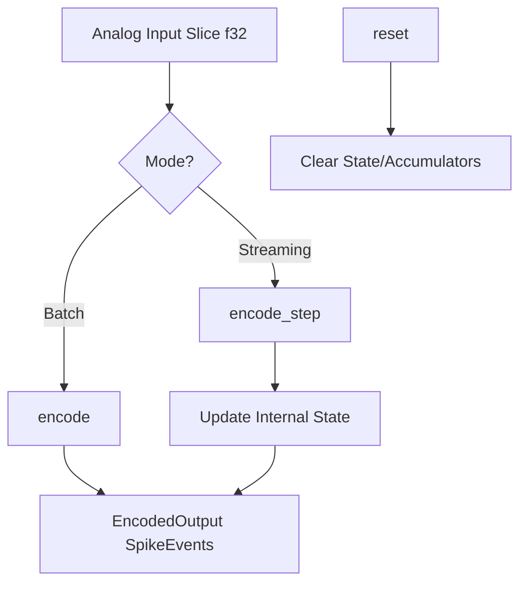
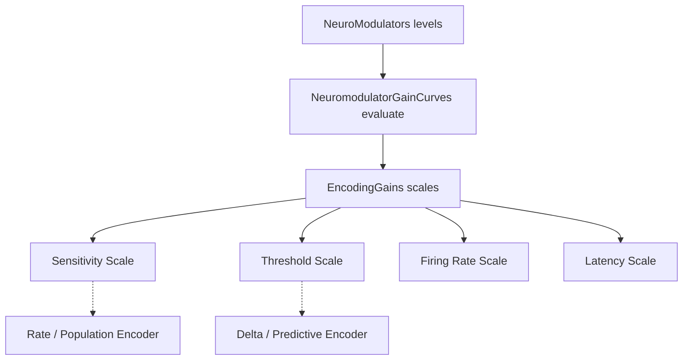

Relevant source files

The following files were used as context for generating this wiki page:

- [README.md](README.md)
- [src/lib.rs](src/lib.rs)
- [src/encoder.rs](src/encoder.rs)
- [src/modulators.rs](src/modulators.rs)
- [src/encoders/rate.rs](src/encoders/rate.rs)
- [src/encoders/phase.rs](src/encoders/phase.rs)
- [src/encoders/population.rs](src/encoders/population.rs)
- [src/encoders/delta.rs](src/encoders/delta.rs)
- [src/encoders/predictive.rs](src/encoders/predictive.rs)
- [src/poisson.rs](src/poisson.rs)

# Home

Axon Encoder is a high-performance sensory encoding library designed for Spiking Neural Networks (SNNs). It serves as the critical bridge between continuous, analog real-world data—such as sensor telemetry or control signals—and the discrete, event-driven "spikes" processed by neuromorphic systems. By providing a suite of standardized algorithms, the library enables developers to translate dense numerical vectors into sparse temporal spike trains.
Sources: [README.md:9-16](README.md#L9-L16), [README.md:126-133](README.md#L126-L133)

The library architecture is built around the `Encoder` and `ModulatedEncoder` traits, supporting both batch processing of complete vectors and incremental streaming of data steps. It includes diverse encoding strategies including rate-based, temporal, predictive, and population encoding, often enhanced by a neuromodulation system that simulates biological gain adjustments.
Sources: [src/lib.rs:56-124](src/lib.rs#L56-L124), [README.md:21-36](README.md#L21-L36)

## Core Architecture and Traits

The system is defined by two primary abstractions that govern how data is transformed into spikes.

### The Encoder Trait
The `Encoder` trait is the fundamental interface for all encoding algorithms. It defines two operational modes:
*  **Batch Mode (`encode`)**: Processes an entire slice of analog values at once.
*  **Streaming Mode (`encode_step`)**: Processes data incrementally, maintaining internal state between calls for temporal or predictive dependencies.

The flow above illustrates how analog inputs are routed through the trait methods to produce event-based outputs.
Sources: [src/lib.rs:99-124](src/lib.rs#L99-L124)

### The ModulatedEncoder Trait
Extending the base functionality, `ModulatedEncoder` allows for dynamic gain adjustment. It maps biological-inspired neuromodulators (like Dopamine or Cortisol) to specific encoding parameters such as firing rates, thresholds, and latencies.
Sources: [src/lib.rs:56-97](src/lib.rs#L56-L97), [src/modulators.rs:218-245](src/modulators.rs#L218-L245)

## Encoding Strategies

Axon Encoder provides several specialized modules for different data characteristics:

| Encoder Type | Mechanism | Best Use Case |
| :--- | :--- | :--- |
| **RateEncoder** | Maps input intensity to spike frequency (Hz). | General purpose sensory conversion. |
| **DeltaEncoder** | Fires spikes when the signal change exceeds a threshold. | Event-based change detection. |
| **PopulationEncoder** | Uses Gaussian tuning curves across multiple neurons. | Distributed representation of single values. |
| **PredictiveEncoder** | Fires based on causal prediction error from history. | Anomaly detection in sensor streams. |
| **PhaseEncoder** | Encodes values as phase-locked spikes in an oscillation. | Rhythmic/Temporal pattern encoding. |
| **PoissonEncoder** | Generates stochastic spike trains via Poisson processes. | Baseline noise or random spike generation. |
Sources: [README.md:21-36](README.md#L21-L36), [src/encoders/rate.rs:3-56](src/encoders/rate.rs#L3-L56), [src/encoders/delta.rs:3-23](src/encoders/delta.rs#L3-L23), [src/encoders/population.rs:3-31](src/encoders/population.rs#L3-L31), [src/encoders/predictive.rs:37-64](src/encoders/predictive.rs#L37-L64), [src/encoders/phase.rs:3-16](src/encoders/phase.rs#L3-L16), [src/poisson.rs:3-23](src/poisson.rs#L3-L23)

## Neuromodulation and Gain Control

The neuromodulation system simulates chemical gain control. It uses `NeuroModulators` to track levels of Dopamine, Cortisol, Acetylcholine, and Tempo, which decay over time unless reinforced. These levels are passed through `GainCurve` objects to calculate `EncodingGains`.

This diagram shows the relationship between chemical levels and the resulting mathematical scaling of encoder parameters.
Sources: [src/modulators.rs:21-36](src/modulators.rs#L21-L36), [src/modulators.rs:218-245](src/modulators.rs#L218-L245), [src/modulators.rs:163-176](src/modulators.rs#L163-L176)

### Gain Curve Semantics
The impact of a `0.0` gain scale is context-dependent:
*  **Threshold Scale = 0.0**: Effective threshold is 0; every input change triggers a spike.
*  **Sensitivity Scale = 0.0**: Output is suppressed (e.g., in PopulationEncoder).
*  **Firing Rate Scale = 0.0**: Firing rate is 0; full silence.
*  **Latency Scale = 0.0**: Max latency is 0; all spikes occur at timestamp 0.
Sources: [src/modulators.rs:163-176](src/modulators.rs#L163-L176)

## Data Structures and Types

The following table details the primary data structures used for communication between encoders and SNN simulation engines.

| Structure | Field | Type | Description |
| :--- | :--- | :--- | :--- |
| **SpikeEvent** | `channel` | `u16` | The index of the firing neuron. |
| | `timestamp` | `u64` | The time bin of the event. |
| | `polarity` | `bool` | Direction of change (true for positive/increase). |
| **EncodedOutput** | `spikes` | `Vec<SpikeEvent>` | Collection of generated spikes. |
| | `embeddings` | `Option<Vec<f32>>` | Optional dense representation. |
| **NeuroModulators** | `dopamine` | `f32` | Levels in range [0, 1]. |
Sources: [src/types.rs:1-35](src/types.rs#L1-L35), [src/modulators.rs:21-27](src/modulators.rs#L21-L27), [src/encoder.rs:34-39](src/encoder.rs#L34-L39)

## Implementation Details

### Rate Encoding Logic
`RateEncoder` supports two primary methods of generation:
1.  **Batch**: Uses `1 - exp(-rate_hz * dt_seconds)` to determine per-step spike probability.
2.  **Streaming**: Accumulates `rate_hz * dt_seconds` into a per-channel phase. When the phase exceeds `1.0`, a spike is emitted and the phase is decremented.
Sources: [src/encoders/rate.rs:3-56](src/encoders/rate.rs#L3-L56), [src/poisson.rs:27-38](src/poisson.rs#L27-L38)

### Predictive Error Calculation
The `PredictiveEncoder` utilizes a warm-up period (first 5 samples) to establish a baseline. After warm-up, it predicts the next value using an exponentially weighted moving average (EWMA) of recent history:
`threshold[i] = 0.9 * threshold[i] + 0.1 * mean(history[-5:])`
Spikes are emitted if `|input - prediction| > deviation_threshold`.
Sources: [src/encoders/predictive.rs:37-64](src/encoders/predictive.rs#L37-L64), [src/encoders/predictive.rs:155-165](src/encoders/predictive.rs#L155-L165)

## Summary

Axon Encoder provides the essential mathematical framework for converting analog signals into the temporal spike patterns required by Spiking Neural Networks. By abstracting complex encoding logic—such as Gaussian tuning for populations or EWMA-based prediction—into a unified trait-based system, it enables modular and extensible neuromorphic application development. The inclusion of a biologically-inspired neuromodulation system further allows for dynamic, context-aware signal processing.
Sources: [README.md:126-146](README.md#L126-L146), [src/lib.rs:99-124](src/lib.rs#L99-L124)
