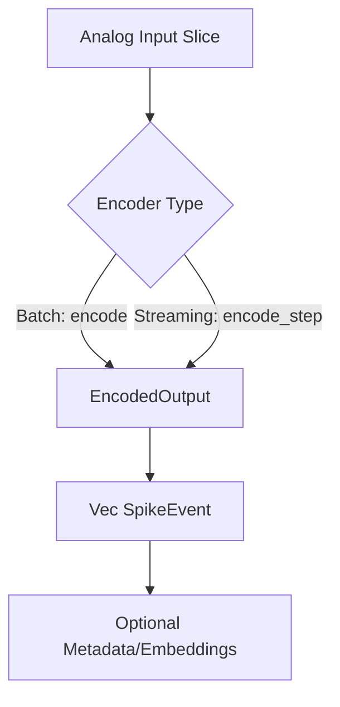

<details>
<summary>Relevant source files</summary>

The following files were used as context for generating this wiki page:

- [README.md](README.md)
- [Cargo.toml](Cargo.toml)
- [src/lib.rs](src/lib.rs)
- [src/encoder.rs](src/encoder.rs)
- [src/encoders/rate.rs](src/encoders/rate.rs)
- [examples/rate_encoding.rs](examples/rate_encoding.rs)
- [examples/delta_encoding.rs](examples/delta_encoding.rs)
</details>

# Quick Start Guide

`axon-encoder` is a sensory encoding library designed for Spiking Neural Networks (SNNs). It provides a specialized suite of algorithms to translate continuous, real-world data—such as sensor telemetry or control signals—into discrete spike events. This process bridges the gap between traditional analog data and the event-driven requirements of neuromorphic systems. 
Sources: [README.md:9-15](README.md#L9-L15), [src/lib.rs:90-93](src/lib.rs#L90-L93)

The library is designed to be lightweight and unopinionated regarding the downstream SNN architecture. It focuses strictly on the mathematical translation of signals to spikes, supporting both deterministic mappings and stochastic Poisson-process spike generation.
Sources: [README.md:158-166](README.md#L158-L166), [src/lib.rs:94-98](src/lib.rs#L94-L98)

## Core Encoding Concepts

The library operates on two primary processing modes defined by the `Encoder` trait: **Batch Mode** for processing complete vectors at once, and **Streaming Mode** for incremental, step-wise processing.
Sources: [src/lib.rs:98-102](src/lib.rs#L98-L102), [src/lib.rs:118-137](src/lib.rs#L118-L137)

### Basic Data Flow
Continuous values enter an encoder and are processed according to the specific strategy (e.g., Rate, Delta, or Population). The result is an `EncodedOutput` structure containing a vector of `SpikeEvent` objects.



The `SpikeEvent` includes the source channel index, a timestamp, and the polarity of the spike. 
Sources: [src/lib.rs:118-137](src/lib.rs#L118-L137), [src/encoder.rs:107-111](src/encoder.rs#L107-L111), [src/lib.rs:69-70](src/lib.rs#L69-L70)

## Installation and Setup

To integrate the library, add the following dependency to your `Cargo.toml`. You can choose to enable the `ndarray` feature for high-performance array view processing.

```toml
[dependencies]
axon-encoder = { git = "https://github.com/Limen-Neural/axon-encoder.git%22 }
# Optional: Enable ndarray support
# axon-encoder = { ..., features = ["ndarray"] }
```

Sources: [README.md:57-73](README.md#L57-L73), [Cargo.toml:13-21](Cargo.toml#L13-L21)

## Implementing a Rate Encoder

The `RateEncoder` is one of the most common encoders, mapping input intensity to firing frequency. Higher input values result in a higher frequency of spikes.
Sources: [README.md:20-22](README.md#L20-L22), [src/encoders/rate.rs:9-12](src/encoders/rate.rs#L9-L12)

### Step-by-Step Implementation

1. **Initialization**: Use `try_new` to define the base rate, max rate, input range, and time step (`dt`).
2. **Input Preparation**: Continuous values (e.g., `f32` slices) are prepared.
3. **Encoding**: Call `encode` or `encode_step`.

```rust
use axon_encoder::prelude::*;

fn main() -> Result<(), EncoderError> {
    // Maps [0.0, 1.0] to 5-100Hz with 10ms sampling
    let mut encoder = RateEncoder::try_new(5.0, 100.0, (0.0, 1.0), 0.010)?;

    let input = [0.2, 0.8, 0.5];
    let output = encoder.encode(&input);
    
    println!("Generated {} spikes", output.spikes.len());
    Ok(())
}
```

Sources: [README.md:78-104](README.md#L78-L104), [examples/rate_encoding.rs:14-22](examples/rate_encoding.rs#L14-L22), [src/lib.rs:106-116](src/lib.rs#L106-L116)

### Rate Encoder Parameters
| Parameter | Type | Description |
| :--- | :--- | :--- |
| `base_rate` | `f32` | Minimum firing rate (Hz) at range minimum. |
| `max_rate` | `f32` | Maximum firing rate (Hz) at range maximum. |
| `range` | `(f32, f32)` | Input data bounds (min, max). |
| `dt_seconds` | `f32` | Duration of one encoding step (default 0.1s). |

Sources: [src/encoders/rate.rs:36-41](src/encoders/rate.rs#L36-L41), [src/encoders/rate.rs:60-64](src/encoders/rate.rs#L60-L64)

## Delta Encoding for Event-Driven Data

The `DeltaEncoder` fires a spike only when the absolute difference between the current input and the last encoded value exceeds a specific threshold. This is highly efficient for sensor data where the baseline may drift but only changes are significant.
Sources: [README.md:30-31](README.md#L30-L31), [src/encoders/delta.rs:9-12](src/encoders/delta.rs#L9-L12)

### Delta Logic Flow

```mermaid
flowchart TD
    Val[Current Value] --> Diff[Calculate Delta: |Val - LastVal|]
    Diff --> Comp{Delta > Threshold?}
    Comp -->|Yes| Spike[Emit SpikeEvent]
    Comp -->|Yes| Update[Update LastVal = Val]
    Comp -->|No| Silence[No Spike]
```

Sources: [src/encoders/delta.rs:16-19](src/encoders/delta.rs#L16-L19), [src/encoders/delta.rs:55-70](src/encoders/delta.rs#L55-L70)

## Advanced Modulation

The library supports neuromodulator-driven gain curves through the `ModulatedEncoder` trait. This allows encoders to adjust their sensitivity, firing rates, or thresholds dynamically based on simulated biological signals like Dopamine or Cortisol.
Sources: [src/lib.rs:43-51](src/lib.rs#L43-L51), [src/encoders/rate.rs:168-180](src/encoders/rate.rs#L168-L180)

### Key Modulated Parameters
| Modulator | Typical Effect (Encoder Specific) |
| :--- | :--- |
| `dopamine` | Often used to boost sensitivity or firing rate. |
| `cortisol` | Often used to adjust thresholds. |
| `acetylcholine` | Can influence temporal precision. |
| `tempo` | Adjusts the time-scale of encoding. |

Sources: [src/lib.rs:72-76](src/lib.rs#L72-L76), [src/encoders/rate.rs:315-325](src/encoders/rate.rs#L315-L325), [examples/delta_encoding.rs:25-35](examples/delta_encoding.rs#L25-L35)

## Conclusion
The `axon-encoder` provides a robust foundation for building neuromorphic interfaces. By selecting the appropriate encoder type—such as `RateEncoder` for intensity or `DeltaEncoder` for change detection—developers can efficiently feed real-world data into spiking neural systems. The library ensures technical accuracy through validated constructors and supports complex behaviors via neuromodulation.
Sources: [README.md:144-148](README.md#L144-L148), [src/lib.rs:90-98](src/lib.rs#L90-L98)
