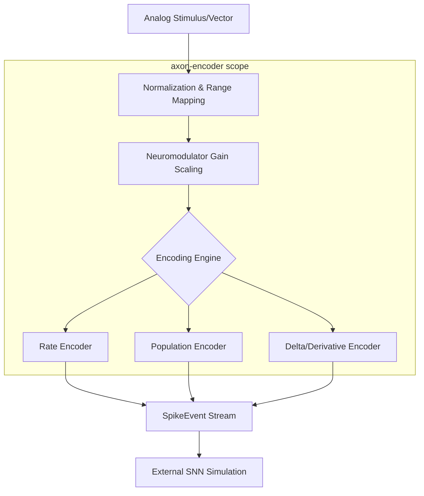
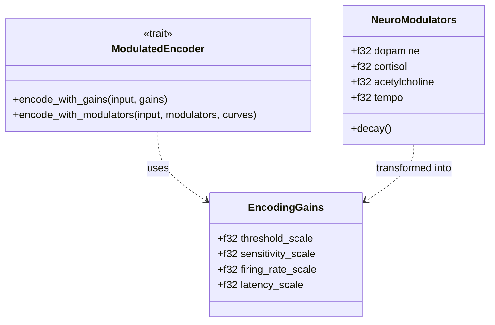

Relevant source files

The following files were used as context for generating this wiki page:

- [README.md](README.md)
- [src/lib.rs](src/lib.rs)
- [src/encoder.rs](src/encoder.rs)
- [src/modulators.rs](src/modulators.rs)
- [src/types.rs](src/types.rs)
- [src/encoders/rate.rs](src/encoders/rate.rs)
- [src/encoders/population.rs](src/encoders/population.rs)

# Design Philosophy & Scope

The `axon-encoder` library is designed as a focused, high-performance sensory encoding bridge for Spiking Neural Networks (SNNs). Its primary purpose is to convert continuous, real-world analog data—such as sensor telemetry or control signals—into discrete spike events that event-driven neuromorphic systems can process.

The project adheres to a philosophy of "Simplicity and Focus," operating as an unopinionated component that does not own SNN simulation, synaptic plasticity, or hardware-specific execution. It provides a standardized interface for various encoding strategies, including rate-based, temporal, and population encoding, while supporting advanced neuromodulator-driven gain control to simulate biological sensitivity adjustments.

Sources: [README.md:9-20](README.md#L9-L20), [README.md:154-159](README.md#L154-L159), [src/lib.rs:88-96](src/lib.rs#L88-L96)

## Core Architectural Principles

### Focused Specialization
The library strictly owns the mathematical mechanisms of signal-to-spike translation. It distinguishes itself from broader neuromorphic frameworks by excluding SNN simulation engines, network topology management, and domain-specific logic.

Sources: [README.md:162-176](README.md#L162-L176)

### Standardized Encoding Interface
All encoding algorithms implement the `Encoder` trait, which defines a uniform protocol for processing data in two distinct modes:
*  **Batch Mode (`encode`)**: Processes a complete input vector at once, often used for offline data conversion.
*  **Streaming Mode (`encode_step`)**: Processes data incrementally, maintaining internal state (such as membrane potentials or accumulators) between calls for real-time applications.

Sources: [src/lib.rs:113-132](src/lib.rs#L113-L132)

### Modularity and Extensibility
The architecture utilizes Rust traits (`Encoder`, `ModulatedEncoder`) to ensure that new encoding strategies can be added without modifying the core pipeline. This allows for a suite of specialized encoders to share common infrastructure for metadata and neuromodulation.

Sources: [src/lib.rs:43-52](src/lib.rs#L43-L52), [README.md:46-48](README.md#L46-L48)

## System Scope & Boundaries

The following table summarizes the operational boundaries of the `axon-encoder` project:

| Category | Included in Scope (Owns) | Excluded from Scope (Does Not Own) |
| :--- | :--- | :--- |
| **Algorithms** | Rate, Derivative, Temporal, Population, Delta, Latency, Phase | Synaptic Plasticity (STDP), Simulation Engines |
| **Data Flow** | Continuous signal to discrete Spike Events | Network topology management, Neuron model simulation |
| **Execution** | Software-based deterministic/stochastic pipelines | FPGA/ASIC/GPU hardware bindings (e.g., silicon-bridge) |
| **Logic** | Signal normalization, gain curve evaluation | Financial, trading, or specific industrial telemetry logic |

Sources: [README.md:162-176](README.md#L162-L176), [src/lib.rs:8-16](src/lib.rs#L8-L16)

The following diagram illustrates the relationship between the analog input and the encoded output within the library's scope:

*The library acts as a transformation layer, mapping input ranges to firing probabilities or thresholds before generating event-based outputs.*

Sources: [src/encoders/rate.rs:15-30](src/encoders/rate.rs#L15-L30), [src/encoders/population.rs:14-25](src/encoders/population.rs#L14-L25), [README.md:15-20](README.md#L15-L20)

## Implementation Logic

### Error Handling Philosophy
The library prioritizes runtime safety through fallible constructors. Most encoders provide `try_new()` methods that return a typed `EncoderError` instead of panicking. This ensures that invalid configurations, such as non-positive time steps (`dt_seconds`) or non-finite ranges, are caught during initialization.

Sources: [src/encoders/rate.rs:84-106](src/encoders/rate.rs#L84-L106), [src/error.rs:1-15](src/error.rs#L1-L15), [README.md:183-195](README.md#L183-L195)

### Neuromodulation and Gain Control
A key design feature is the `ModulatedEncoder` trait, which allows encoders to react to biological-like signals (Dopamine, Cortisol, Acetylcholine, Tempo). These modulators adjust encoder components via multiplicative gain curves.

*Neuromodulator levels are evaluated against `GainCurve` objects to produce `EncodingGains` that scale the internal parameters of the encoders.*

Sources: [src/lib.rs:43-70](src/lib.rs#L43-L70), [src/modulators.rs:114-135](src/modulators.rs#L114-L135), [src/modulators.rs:163-180](src/modulators.rs#L163-L180)

### Stochastic vs. Deterministic Pipelines
The library supports two mathematical models for spike generation:
1.  **Stochastic (Poisson-like)**: Used in `RateEncoder` (batch) and `PopulationEncoder`. It draws random floats to decide spikes based on a calculated probability $p = 1 - \exp(-\text{rate} \times dt)$.
2.  **Deterministic (Accumulator-based)**: Used in `RateEncoder` (streaming) and `DeltaEncoder`. It accumulates "charge" or monitors differences until a hard threshold is reached, then fires and resets.

Sources: [src/encoders/rate.rs:16-30](src/encoders/rate.rs#L16-L30), [src/poisson.rs:1-12](src/poisson.rs#L1-L12), [src/encoders/delta.rs:14-20](src/encoders/delta.rs#L14-L20)

## Conclusion
`axon-encoder` provides a specialized, modular toolset for the first stage of neuromorphic processing. By focusing strictly on the sensory encoding interface and maintaining a clear separation from downstream simulation or hardware concerns, the library ensures high technical performance and ease of integration into larger Spiking Neural Network ecosystems.

Sources: [README.md:154-159](README.md#L154-L159), [src/lib.rs:8-16](src/lib.rs#L8-L16)
