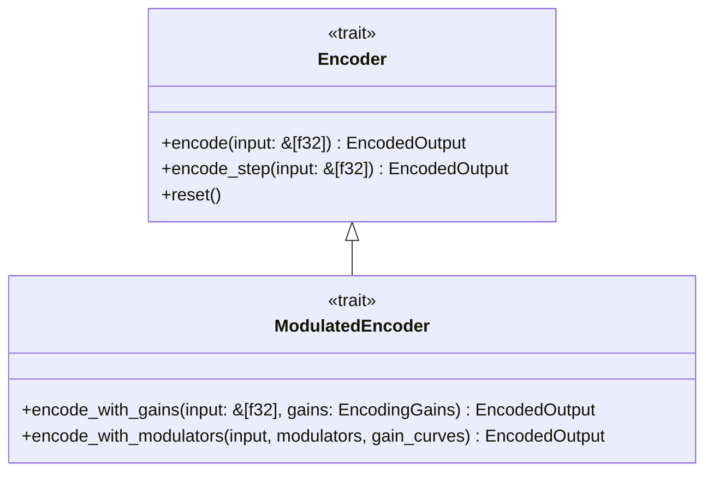
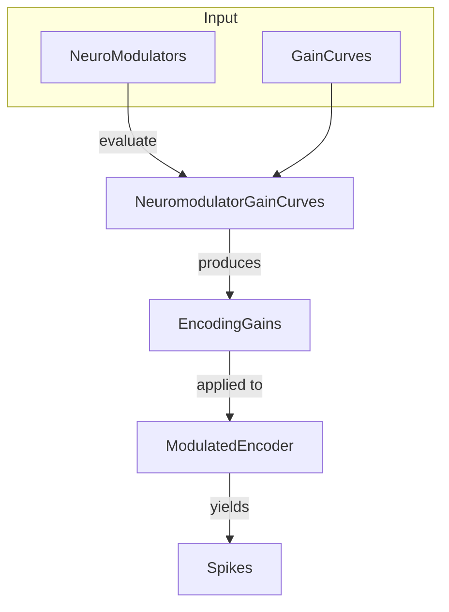

<details>
<summary>Relevant source files</summary>

The following files were used as context for generating this wiki page:

- [src/types.rs](src/types.rs)
- [src/lib.rs](src/lib.rs)
- [src/encoder.rs](src/encoder.rs)
- [src/modulators.rs](src/modulators.rs)
- [src/encoders/rate.rs](src/encoders/rate.rs)
</details>

# Core Traits and Types

The `axon-encoder` library establishes a standardized framework for converting continuous analog signals into discrete spike events suitable for Spiking Neural Networks (SNNs). This conversion process is governed by a set of core traits and data structures that ensure interoperability between different encoding strategies, such as rate, temporal, and predictive encoding.

At the heart of the architecture is the `Encoder` trait, which defines the standard interface for both batch and streaming data processing. This is complemented by the `ModulatedEncoder` trait, which introduces neuromodulation capabilities, allowing external signals (e.g., dopamine, cortisol) to dynamically scale encoding parameters like firing rates and thresholds.

Sources: [src/lib.rs:94-110](src/lib.rs#L94-L110), [src/types.rs:1-3](src/types.rs#L1-L3), [README.md:16-24](README.md#L16-L24)

## Core Abstractions

### The Encoder Trait
The `Encoder` trait is the primary interface for all encoding algorithms. It supports two distinct operational modes: Batch Mode for processing entire vectors at once and Streaming Mode for incremental, step-wise processing.



The diagram above illustrates the relationship between the base `Encoder` and the extended `ModulatedEncoder` traits.

| Method | Mode | Description |
| :--- | :--- | :--- |
| `encode` | Batch | Processes a complete input slice and returns all generated spikes. |
| `encode_step` | Streaming | Processes one incremental step; stateful encoders override this to maintain internal state. |
| `reset` | Management | Restores the encoder to its initial state (e.g., clearing accumulators or history). |

Sources: [src/lib.rs:94-131](src/lib.rs#L94-L131)

### The ModulatedEncoder Trait
This trait extends the basic encoder functionality to support "gain curves." It allows the encoder to adjust its sensitivity, threshold, or firing rate based on a set of `EncodingGains` derived from neuromodulator levels.

Sources: [src/lib.rs:43-68](src/lib.rs#L43-L68), [src/modulators.rs:188-202](src/modulators.rs#L188-L202)

## Data Structures and Types

### SpikeEvent
The fundamental unit of output in the system. A `SpikeEvent` represents a single event-driven signal occurring on a specific channel at a specific time.

| Field | Type | Description |
| :--- | :--- | :--- |
| `channel` | `u16` | The index of the neuron or channel that fired. Max 65,536 channels. |
| `timestamp` | `u64` | The time or relative step at which the spike occurred. |
| `polarity` | `bool` | Represents the direction or type of spike (e.g., excitatory vs. inhibitory). |

Sources: [src/types.rs:5-10](src/types.rs#L5-L10), [src/encoder.rs:67-70](src/encoder.rs#L67-L70)

### EncodedOutput
Every encoder returns an `EncodedOutput` structure, which aggregates spikes and optional metadata.

```rust
pub struct EncodedOutput {
    pub spikes: Vec<SpikeEvent>,
    pub embeddings: Option<Vec<f32>>,
    pub metadata: Option<EncodingMetadata>,
}
```

Sources: [src/types.rs:20-25](src/types.rs#L20-L25)

### Encoder Configuration and State
Basic configurations and state management are handled through the following structures:

*  **`EncoderConfig`**: Defines global parameters such as the number of input and output channels. Defaults to 256 for both.
*  **`EncoderState`**: Holds transient data like `membrane_potentials` for encoders that use integrate-and-fire logic.

Sources: [src/types.rs:35-42](src/types.rs#L35-L42), [src/encoder.rs:32-35](src/encoder.rs#L32-L35)

## Neuromodulation System

The neuromodulation system uses "Gain Curves" to map physiological modulator levels (0.0 to 1.0) to actual scaling factors applied to encoder components.



The diagram shows the flow from raw modulator values to the final generation of scaled spikes.

### Modulator Types
The system tracks four primary neuromodulators, each with specific decay rates:
1.  **Dopamine**: Decays at 0.95 per step.
2.  **Cortisol**: Decays at 0.90 per step.
3.  **Acetylcholine**: Decays at 0.99 per step.
4.  **Tempo**: Decays at 0.98 per step.

Sources: [src/modulators.rs:1-6](src/modulators.rs#L1-L6), [src/modulators.rs:20-25](src/modulators.rs#L20-L25)

### Gain Mapping Semantics
Gains are sanitized to stay within a stable range (`0.0` to `10000.0`). The interpretation of a `0.0` gain scale is component-specific:

*  **Threshold Scale**: `0.0` results in an effective threshold of 0 (maximum sensitivity).
*  **Sensitivity Scale**: `0.0` suppresses outputs (typical for Population encoders).
*  **Firing Rate Scale**: `0.0` results in total silence.
*  **Latency Scale**: `0.0` results in instantaneous response (timestamp 0).

Sources: [src/modulators.rs:141-155](src/modulators.rs#L141-L155), [src/modulators.rs:7-18](src/modulators.rs#L7-L18)

## Implementation Example: RateEncoder
The `RateEncoder` demonstrates how these traits and types are combined. It uses `base_rate` and `max_rate` (in Hz) and a `dt_seconds` time step to calculate firing probabilities.

```rust
// Streaming accumulation logic
let increment = (rate_hz * dt_seconds);
accumulator[i] += increment;
if accumulator[i] >= 1.0 {
    emit_spike();
    accumulator[i] -= 1.0;
}
```

Sources: [src/encoders/rate.rs:18-35](src/encoders/rate.rs#L18-L35), [src/encoders/rate.rs:197-210](src/encoders/rate.rs#L197-L210)

The `Core Traits and Types` provide a rigid yet extensible interface that allows the `axon-encoder` library to remain agnostic of specific SNN simulation engines while providing robust, high-performance sensory translation.

Sources: [README.md:95-103](README.md#L95-L103)
