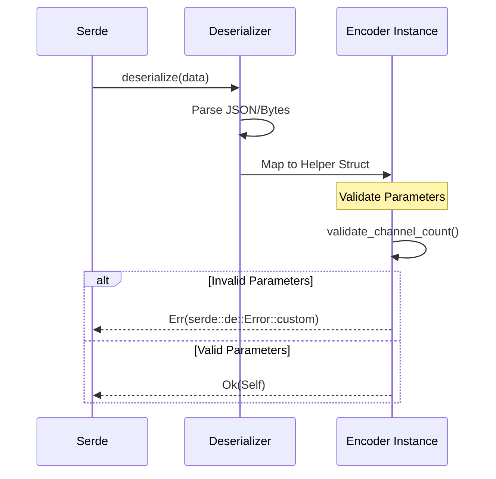

<details>
<summary>Relevant source files</summary>

The following files were used as context for generating this wiki page:

- [src/error.rs](src/error.rs)
- [README.md](README.md)
- [src/encoders/predictive.rs](src/encoders/predictive.rs)
- [src/encoders/rate.rs](src/encoders/rate.rs)
- [src/encoders/phase.rs](src/encoders/phase.rs)
- [src/encoders/temporal.rs](src/encoders/temporal.rs)
- [src/encoders/delta.rs](src/encoders/delta.rs)
- [src/encoders/population.rs](src/encoders/population.rs)
- [src/encoder.rs](src/encoder.rs)
</details>

# Error Handling (EncoderError)

Error handling in the `axon-encoder` library is primarily managed through the `EncoderError` enum. This system provides a stable, unified interface for reporting configuration and runtime validation failures across various encoding algorithms. Its purpose is to replace panicking behavior with typed, fallible constructors (`try_new`), allowing applications to gracefully handle invalid parameters such as non-finite rates, illegal ranges, or excessive channel counts.

Sources: [src/error.rs:4-7](src/error.rs#L4-L7), [README.md:155-161](README.md#L155-L161)

## The EncoderError Enum

The `EncoderError` enum defines specific variants for different failure modes encountered during encoder construction or state deserialization. It is marked with `#[non_exhaustive]` to allow for future additions without breaking compatibility.

### Error Variants
The following table summarizes the primary error types defined in the system:

| Variant | Description | Relevant Parameters |
| :--- | :--- | :--- |
| `NonFiniteRate` | A rate parameter (e.g., base_rate, max_rate) is NaN or Infinity. | `parameter: &'static str` |
| `RateOrder` | The `base_rate` exceeds the `max_rate`. | N/A |
| `InvalidRange` | Range bounds are non-finite or the minimum is not less than the maximum. | `parameter: &'static str` |
| `CountMustBePositive` | Parameters like `num_neurons` must be greater than zero. | `parameter: &'static str` |
| `NonPositiveOrNonFinite` | Threshold or width parameters must be finite and > 0. | `parameter: &'static str` |
| `NumChannelsTooLarge` | The channel count exceeds the maximum addressable limit (65,536). | N/A |
| `HistoryDepthTooSmall` | The history buffer size is insufficient for the algorithm. | `minimum: usize` |
| `StateLengthMismatch` | Inconsistent lengths detected in deserialized state vectors. | `left`, `right` strings |
| `WindowMustBePositive` | Cycle or window parameters must be non-zero. | `parameter: &'static str` |

Sources: [src/error.rs:6-33](src/error.rs#L6-L33), [src/error.rs:105-111](src/error.rs#L105-L111)

### Error Message Formatting
The `fmt::Display` implementation provides human-readable descriptions for each error, facilitating easier debugging and logging. For example, `NonFiniteRate` formats as `"{parameter} must be finite"`.

Sources: [src/error.rs:35-71](src/error.rs#L35-L71)

## Validation Logic and Helpers

The library includes internal utility functions to standardize validation logic across different modules.

### Internal Validation Helpers
*  **`validate_range`**: Checks that range bounds are finite and that `min < max`. Used by `PhaseEncoder`.
*  **`validate_range_f32_span`**: Extends range validation by ensuring the total span (`max - min`) does not overflow `f32` arithmetic. Used by `RateEncoder` and `PopulationEncoder`.
*  **`validate_channel_count`**: Ensures the number of channels does not exceed `MAX_SPIKE_CHANNELS` (65,536), which is the limit for `u16` spike channel IDs.
*  **`validate_non_negative_finite`**: Verifies that a value is both finite and `>= 0.0`.

Sources: [src/error.rs:75-121](src/error.rs#L75-L121), [src/encoders/rate.rs:96-101](src/encoders/rate.rs#L96-L101), [src/encoders/phase.rs:32-34](src/encoders/phase.rs#L32-L34)

### Flow of Validation
When an encoder is initialized, the parameters pass through these validation gates before the struct is successfully instantiated.

```mermaid
graph TD
    Start[Constructor Call: try_new] --> ParamCheck{Check Parameters}
    ParamCheck -- Invalid --> Err[Return EncoderError]
    ParamCheck -- Valid --> Instance[Return Ok(Self)]
    
    subgraph Validation_Logic[Validation Logic]
    V1[validate_range]
    V2[validate_channel_count]
    V3[validate_non_negative_finite]
    end
    
    ParamCheck -.-> V1
    ParamCheck -.-> V2
    ParamCheck -.-> V3
```

This diagram shows the high-level flow from a constructor call to a validated instance or a returned error.
Sources: [src/error.rs:75-121](src/error.rs#L75-L121), [src/encoders/delta.rs:43-47](src/encoders/delta.rs#L43-L47)

## Fallible Constructor Pattern

A key architectural decision in the library is the transition from panicking `new()` constructors to fallible `try_new()` constructors. 

### Implementation Across Encoders
Most encoders now implement the `try_new` pattern, while `new` serves as a wrapper that panics on error for backward compatibility.

*  **RateEncoder**: Validates `base_rate`, `max_rate`, `range`, and `dt_seconds`.
*  **PopulationEncoder**: Validates `num_neurons`, `input_range`, and `tuning_width`.
*  **DeltaEncoder**: Validates `threshold` and channel count.
*  **PhaseEncoder**: Validates `cycle_steps` and `range`.

Sources: [src/encoders/rate.rs:88-106](src/encoders/rate.rs#L88-L106), [src/encoders/population.rs:56-78](src/encoders/population.rs#L56-L78), [src/encoders/delta.rs:43-47](src/encoders/delta.rs#L43-L47), [src/encoders/phase.rs:46-49](src/encoders/phase.rs#L46-L49)

### PredictiveEncoder Specialization
`PredictiveEncoder` previously used a unique error type, `PredictiveEncoderError`. For consistency, it now provides a `try_new` method that returns the unified `EncoderError`. The conversion is handled via the `From` trait implementation.

Sources: [src/encoders/predictive.rs:7-46](src/encoders/predictive.rs#L7-L46), [src/encoders/predictive.rs:114-129](src/encoders/predictive.rs#L114-L129)

## Deserialization Safety

When the `serde` feature is enabled, encoders perform the same validation logic during deserialization to ensure that loaded states are valid.

### Deserialization Validation Flow
If invalid data is detected in a serialized state (e.g., a `history_depth` that is too small), the `Deserialize` implementation returns a custom Serde error, wrapping the `EncoderError`.



This diagram illustrates how validation is integrated into the deserialization process to prevent the creation of invalid encoder states.
Sources: [src/encoders/temporal.rs:136-179](src/encoders/temporal.rs#L136-L179), [src/encoders/rate.rs:241-267](src/encoders/rate.rs#L241-L267), [src/encoders/predictive.rs:223-264](src/encoders/predictive.rs#L223-L264)

### Deserialization Error Cases
Specific validation checks during deserialization include:
*  **Length Consistency**: Ensuring `history` deques match the number of channels.
*  **History Depth**: Ensuring `history_depth` has not been altered to a value smaller than the algorithm's minimum requirements (e.g., 6 for `TemporalEncoder`, 5 for `PredictiveEncoder`).
*  **State Integrity**: Verifying that `accumulators` or `last_values` are finite.

Sources: [src/encoders/temporal.rs:156-179](src/encoders/temporal.rs#L156-L179), [src/encoders/predictive.rs:240-264](src/encoders/predictive.rs#L240-L264), [src/encoder.rs:69-80](src/encoder.rs#L69-L80)

## Conclusion

The `EncoderError` system provides a robust framework for managing failures in the `axon-encoder` library. By centralizing validation logic and moving towards fallible constructors, the library ensures that sensory encoding pipelines are resilient and that configuration errors are caught at the boundary of the system rather than during simulation. This typed error handling is critical for industrial applications where real-world sensor data may be unpredictable or malformed.
