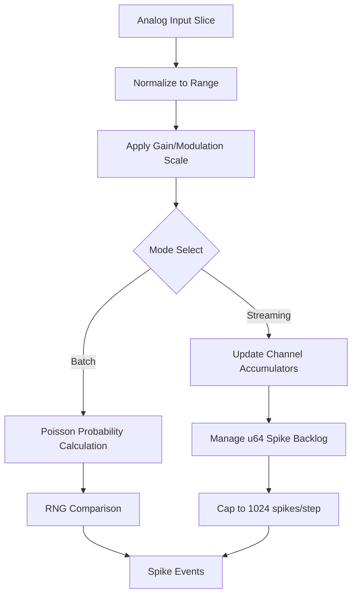

<details>
<summary>Relevant source files</summary>

The following files were used as context for generating this wiki page:

- [src/encoders/rate.rs](src/encoders/rate.rs)
- [examples/rate_encoding.rs](examples/rate_encoding.rs)
- [src/poisson.rs](src/poisson.rs)
- [src/error.rs](src/error.rs)
- [src/encoder.rs](src/encoder.rs)
- [README.md](README.md)
</details>

# Rate Encoder

The `RateEncoder` is a core component of the `axon-encoder` library designed to bridge the gap between continuous analog signals and the event-driven requirements of Spiking Neural Networks (SNNs). It maps continuous input values (such as sensor readings or telemetry) into spike rates where higher input intensities result in higher firing frequencies.

Sources: [README.md:10-14](README.md#L10-L14), [src/encoders/rate.rs:3-8](src/encoders/rate.rs#L3-L8)

The encoder supports two distinct operational modes: **Batch Mode**, which generates independent probabilistic spikes based on a Poisson process, and **Streaming Mode**, which uses an internal accumulator to fire spikes deterministically once a threshold is reached. This flexibility allows for both stochastic simulation and precise real-time signal translation.

Sources: [src/encoders/rate.rs:10-13](src/encoders/rate.rs#L10-L13), [src/poisson.rs:1-8](src/poisson.rs#L1-L8)

## Mathematical Models

The `RateEncoder` employs different mathematical logic depending on whether it is performing a batch or streaming operation. Both modes rely on mapping the input to an effective firing rate in Hertz (Hz) within a user-defined range.

### Batch Encoding (Stochastic)
In batch mode, every call to `encode` is treated as an independent event. The probability of a spike occurring in a given time step is calculated using a Poisson process distribution.
1.  **Normalize Input**: $normalized = \text{clamp}(\frac{value - min}{max - min}, 0.0, 1.0)$
2.  **Calculate Rate**: $rate_{hz} = base\_rate + normalized \times (max\_rate - base\_rate)$
3.  **Determine Probability**: $P = 1 - \exp(-rate_{hz} \times dt_{seconds})$
4.  **Fire**: Spike occurs if $random\_float(0, 1) < P$

Sources: [src/encoders/rate.rs:17-21](src/encoders/rate.rs#L17-L21), [src/poisson.rs:35-43](src/poisson.rs#L35-L43)

### Streaming Encoding (Deterministic)
In streaming mode (`encode_step`), the encoder maintains state across calls using internal phase accumulators. This ensures that the long-term firing rate precisely matches the input intensity.
1.  **Accumulate**: $accumulator[i] += rate_{hz} \times dt_{seconds}$
2.  **Threshold Check**: If $accumulator[i] \geq 1.0$, emit a spike.
3.  **Reset**: $accumulator[i] -= 1.0$ (Soft reset to preserve fractional remainders).

Sources: [src/encoders/rate.rs:23-27](src/encoders/rate.rs#L23-L27), [src/encoder.rs:115-125](src/encoder.rs#L115-L125)

## Architecture and Data Flow

The `RateEncoder` manages per-channel state to support multi-channel input vectors. It utilizes `u64` backlogs to prevent spike loss during high-frequency bursts that exceed the processing limits of a single simulation step.



This diagram illustrates the internal processing pipeline from raw input to generated spike events. 
Sources: [src/encoders/rate.rs:141-158](src/encoders/rate.rs#L141-L158), [src/encoders/rate.rs:194-220](src/encoders/rate.rs#L194-L220)

## Configuration and Parameters

The `RateEncoder` is configured via several key parameters that define its sensitivity and temporal resolution.

| Parameter | Type | Description |
| :--- | :--- | :--- |
| `base_rate` | `f32` | Minimum firing rate (Hz) when input is at range minimum. |
| `max_rate` | `f32` | Maximum firing rate (Hz) when input is at range maximum. |
| `range` | `(f32, f32)` | The expected (min, max) span of the input values. |
| `dt_seconds` | `f32` | The duration in seconds represented by each encoding step. Defaults to 0.1s. |

Sources: [src/encoders/rate.rs:32-37](src/encoders/rate.rs#L32-L37), [src/encoders/rate.rs:60-61](src/encoders/rate.rs#L60-L61)

## Key Data Structures

### RateEncoder Struct
The struct maintains the configuration and the runtime state required for streaming.

```rust
pub struct RateEncoder {
    base_rate: f32,
    max_rate: f32,
    range: (f32, f32),
    dt_seconds: f32,
    phases: Vec<f64>,        // Fractional phase per channel [0, 1)
    pending_spikes: Vec<u64>, // Whole-spike backlog per channel
}
```

Sources: [src/encoders/rate.rs:49-62](0, 1)
  pending_spikes: Vec<u64>, // Whole-spike backlog per channel
}
```
Sources: [src/encoders/rate.rs:49-62)

### Error Handling
The encoder uses the `EncoderError` enum to validate configuration during construction via `try_new`. Common errors include `RateOrder` (if `base_rate > max_rate`) and `NonPositiveOrNonFinite` for `dt_seconds`.
Sources: [src/error.rs:6-25](src/error.rs#L6-L25), [src/encoders/rate.rs:85-98](src/encoders/rate.rs#L85-L98)

## Implementation Details

### Backlog Management
The `RateEncoder` includes a safety mechanism to prevent infinite loops or memory exhaustion during extreme input bursts. It caps the number of spikes emitted per channel per step to `1024`. Any excess spikes are stored in the `pending_spikes` `u64` vector and drained in subsequent steps.
Sources: [src/encoders/rate.rs:179-185](src/encoders/rate.rs#L179-L185), [src/encoders/rate.rs:200-210](src/encoders/rate.rs#L200-L210)

### Serialization
When the `serde` feature is enabled, `RateEncoder` supports state persistence. It handles legacy formats by mapping old `accumulators` fields (which combined phase and spikes) into the new split `phases` and `pending_spikes` structure.
Sources: [src/encoders/rate.rs:251-285](src/encoders/rate.rs#L251-L285)

### Neuromodulation
The encoder implements `ModulatedEncoder`, allowing external factors (like dopamine or acetylcholine levels) to scale the firing rate dynamically via `encode_with_modulators`.
Sources: [src/encoders/rate.rs:225-236](src/encoders/rate.rs#L225-L236), [src/encoders/rate.rs:317-321](src/encoders/rate.rs#L317-L321)

## Summary
The `RateEncoder` provides a robust, dual-mode implementation for frequency-based sensory encoding. By combining a Poisson-based stochastic model for batch processing with a precise accumulator-based model for streaming, it serves as a versatile interface for translating continuous data into the spike-based domain of neuromorphic systems. 

Sources: [src/encoders/rate.rs:3-40](src/encoders/rate.rs#L3-L40), [README.md:143-150](README.md#L143-L150)
