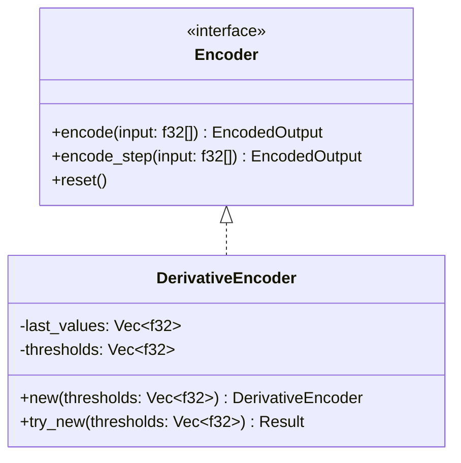
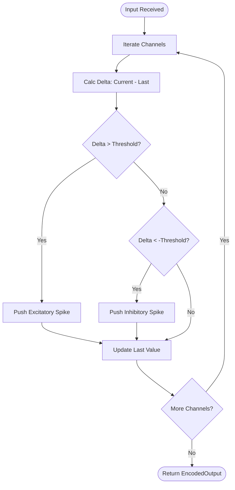

Relevant source files

The following files were used as context for generating this wiki page:

- [src/encoders/derivative.rs](src/encoders/derivative.rs)
- [src/encoders/mod.rs](src/encoders/mod.rs)
- [src/encoder.rs](src/encoder.rs)
- [src/lib.rs](src/lib.rs)
- [src/types.rs](src/types.rs) (implied by usage in types module)
- [README.md](README.md)
- [tests/serde_tests.rs](tests/serde_tests.rs)

# Derivative Encoder

The `DerivativeEncoder` is a specialized component within the `axon-encoder` library designed to translate continuous analog signals into spike trains based on the signal's rate of change. It is particularly effective for detecting sudden jumps or drops in input data, making it suitable for edge detection or motion sensing in neuromorphic systems.

The encoder operates by tracking the difference (delta) between the current input value and the previous value for each channel. If the positive change exceeds a defined threshold, an excitatory spike is fired; conversely, if the negative change exceeds the threshold, an inhibitory spike is fired.

Sources: [src/encoders/derivative.rs:5-10](src/encoders/derivative.rs#L5-L10), [README.md:21-22](README.md#L21-L22)

## Architecture and Core Logic

The `DerivativeEncoder` implements the `Encoder` trait, providing a stateful mechanism to process input vectors. It maintains internal state to track the "last values" seen across all channels to calculate derivatives on subsequent steps.

### Data Structures

The core structure consists of two vectors:
- `last_values`: Stores the most recent `f32` value for each channel.
- `thresholds`: Stores the sensitivity threshold for each channel.

Sources: [src/encoders/derivative.rs:11-14](src/encoders/derivative.rs#L11-L14), [src/lib.rs:107-128](src/lib.rs#L107-L128)

### Encoding Logic and Spike Generation

The encoding process follows a deterministic comparison for every channel provided in the input.

1.  **Delta Calculation**: `delta = current_val - last_values[i]`
2.  **Positive Threshold Check**: If `delta > thresholds[i]`, push a `SpikeEvent` with `polarity: true`.
3.  **Negative Threshold Check**: If `delta < -thresholds[i]`, push a `SpikeEvent` with `polarity: false`.
4.  **State Update**: `last_values[i]` is updated to `current_val`.

Sources: [src/encoders/derivative.rs:71-100](src/encoders/derivative.rs#L71-L100)

## Configuration and Initialization

`DerivativeEncoder` provides two primary constructors. `new` is a convenience method that panics on invalid input, while `try_new` returns an `EncoderError` for robust error handling.

### Constructor Requirements
| Parameter | Type | Constraints | Description |
| :--- | :--- | :--- | :--- |
| `thresholds` | `Vec<f32>` | Finite, Non-negative | Per-channel sensitivity for firing spikes. |
| `num_channels` | Implicit | max `u16::MAX` | Total channels are derived from the length of the thresholds vector. |

Sources: [src/encoders/derivative.rs:49-65](src/encoders/derivative.rs#L49-L65)

### Error Handling
The encoder validates that all thresholds are finite and non-negative. It also ensures the channel count does not exceed the addressable limit of the `u16` IDs used in `SpikeEvent`.

Sources: [src/encoders/derivative.rs:59-62](src/encoders/derivative.rs#L59-L62), [src/encoders/derivative.rs:160-175](src/encoders/derivative.rs#L160-L175)

## Serialization (Serde)

When the `serde` feature is enabled, `DerivativeEncoder` supports serialization and deserialization. It uses a custom representation (`DerivativeEncoderRepr`) to ensure that state remains consistent during restoration, specifically validating that `last_values` and `thresholds` maintain matching lengths.

### Serialization Validation
- Ensures `last_values` length matches `thresholds` length.
- Verifies all restored `last_values` are finite.
- Re-runs configuration validation (non-negative thresholds).

Sources: [tests/serde_tests.rs:242-247](tests/serde_tests.rs#L242-L247), [src/encoders/derivative.rs:21-41](src/encoders/derivative.rs#L21-L41)

## State Management

### Reset Mechanism
The `reset()` function clears the internal memory of the encoder by setting all `last_values` back to `0.0`. This is critical when switching between different data streams to prevent "phantom" derivative spikes caused by the difference between the end of the old stream and the start of the new one.

Sources: [src/encoders/derivative.rs:104-108](src/encoders/derivative.rs#L104-L108), [src/encoders/derivative.rs:136-141](src/encoders/derivative.rs#L136-L141)

### Channel Mismatch Behavior
If the input slice provided to `encode` or `encode_step` has more values than the configured number of channels, the excess values are ignored. If the input slice is shorter, only the available channels are updated, and the remaining internal state remains unchanged.

Sources: [src/encoders/derivative.rs:144-149](src/encoders/derivative.rs#L144-L149), [src/encoders/derivative.rs:213-222](src/encoders/derivative.rs#L213-L222)

## Summary

The `DerivativeEncoder` serves as a temporal edge detector within the `axon-encoder` ecosystem. By maintaining a per-channel history and comparing instantaneous changes against configurable thresholds, it provides a simple yet effective way to generate signed spikes (excitatory for increases, inhibitory for decreases) from continuous data. Its stateful nature and support for independent per-channel thresholds make it highly adaptable for complex multi-sensor telemetry processing.

Sources: [src/encoders/derivative.rs:5-10](src/encoders/derivative.rs#L5-L10), [README.md:54-55](README.md#L54-L55)
