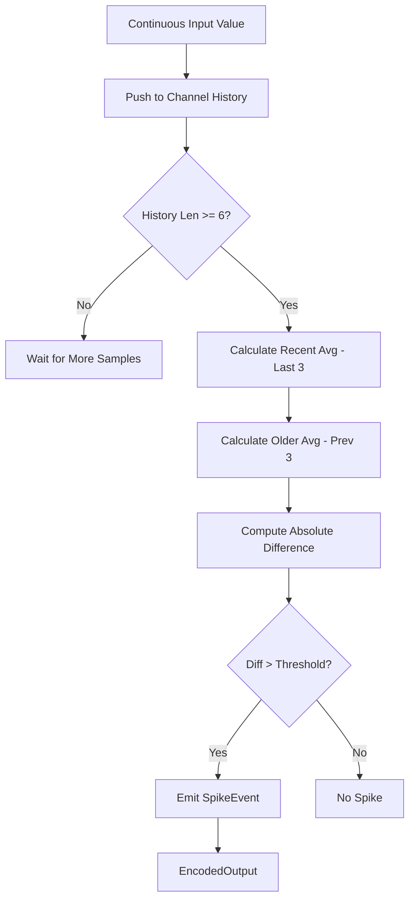
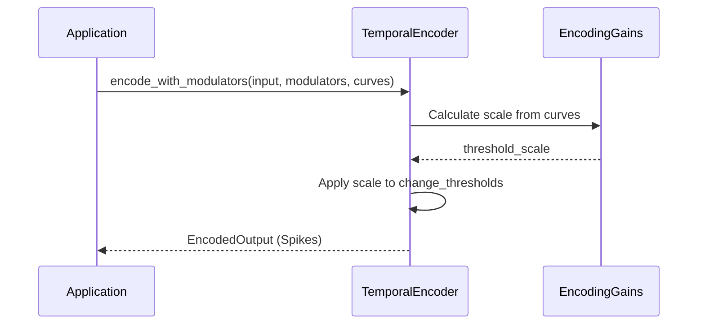

<details>
<summary>Relevant source files</summary>

The following files were used as context for generating this wiki page:

- [src/encoders/temporal.rs](src/encoders/temporal.rs)
- [examples/temporal_encoding.rs](examples/temporal_encoding.rs)
- [src/encoders/mod.rs](src/encoders/mod.rs)
- [README.md](README.md)
- [tests/serde_tests.rs](tests/serde_tests.rs)
- [benches/encoders.rs](benches/encoders.rs)
- [benches/allocations.rs](benches/allocations.rs)
</details>

# Temporal Encoder

The **Temporal Encoder** is a specialized sensory encoding module within the `axon-encoder` library designed to detect temporal patterns in continuous data. Its primary purpose is to convert real-world signals into discrete spikes based on the rate of change over time, making it particularly effective for tasks such as motion detection or edge detection in sensor streams. Unlike [Rate Encoders](#rate-encoding), which fire based on absolute values, the Temporal Encoder fires when specific sequences or sudden shifts are observed in the input history.

Sources: [README.md:15-16](README.md#L15-L16), [src/encoders/temporal.rs:4-7](src/encoders/temporal.rs#L4-L7), [src/encoders/temporal.rs:18-22](src/encoders/temporal.rs#L18-L22)

## Architecture and Mathematical Model

The Temporal Encoder maintains a sliding window of historical values for every input channel. It utilizes this history to calculate the difference between the most recent average and an older average to determine if a "change event" has occurred.

### Logic Flow

1.  **History Tracking**: For each channel, a `VecDeque` tracks the last $N$ values, where $N$ is defined by `history_depth`.
2.  **Mean Calculation**: The encoder calculates two averages:
  *  **Recent Average**: The mean of the last 3 values in the history.
  *  **Older Average**: The mean of the 3 values immediately preceding the recent ones.
3.  **Spike Generation**: A spike is emitted if the absolute difference between these two averages exceeds a configured threshold.

```text
change = |mean(history[-3:]) - mean(history[-6:-3])|
spike if change > threshold
```

Sources: [src/encoders/temporal.rs:10-16](src/encoders/temporal.rs#L10-L16), [src/encoders/temporal.rs:32-34](src/encoders/temporal.rs#L32-L34), [src/encoders/temporal.rs:114-118](src/encoders/temporal.rs#L114-L118)

### Data Flow Diagram

The following diagram illustrates the transformation from continuous input to discrete spike events within a single channel of the Temporal Encoder.



The diagram represents the processing logic found in `encode_with_threshold_scale`.
Sources: [src/encoders/temporal.rs:90-125](src/encoders/temporal.rs#L90-L125)

## Components and Configuration

The `TemporalEncoder` is defined by its history management and a set of tiered thresholds that determine spike values.

### Key Data Structures

| Structure | Description |
| :--- | :--- |
| `history` | A `Vec<VecDeque<f32>>` storing temporal samples per channel. |
| `history_depth` | The total number of past values to track per channel (minimum 6). |
| `change_thresholds` | A `Vec<(f32, u16)>` containing pairs of (threshold, spike_value). |

Sources: [src/encoders/temporal.rs:31-36](src/encoders/temporal.rs#L31-L36), [src/encoders/temporal.rs:69-71](src/encoders/temporal.rs#L69-L71)

### Configuration Parameters

| Parameter | Type | Default/Requirement | Description |
| :--- | :--- | :--- | :--- |
| `history_depth` | `usize` | Must be $\ge 6$ | Determines the window size for temporal comparison. |
| `change_thresholds` | `Vec<(f32, u16)>` | Finite, non-negative | List of thresholds; only one spike fires per step (highest threshold reached). |
| `num_channels` | `usize` | $\le u16::MAX + 1$ | The number of independent input channels. |

Sources: [src/encoders/temporal.rs:35-50](src/encoders/temporal.rs#L35-L50), [tests/serde_tests.rs:125-131](tests/serde_tests.rs#L125-L131)

## Implementation Details

### Initialization and Validation
The encoder provides a fallible constructor `try_new` and a panicking constructor `new`. Validation ensures that the `history_depth` is sufficient to perform the comparative mean calculation (requiring at least 6 samples).

```rust
// Example initialization
let mut encoder = TemporalEncoder::try_new(
    10,                   // history_depth
    vec![(2.0, 1)],       // threshold 2.0, spike value 1
    2                     // 2 channels
).expect("valid config");
```

Sources: [src/encoders/temporal.rs:52-78](src/encoders/temporal.rs#L52-L78), [examples/temporal_encoding.rs:19-22](examples/temporal_encoding.rs#L19-L22)

### Neuromodulation
The Temporal Encoder implements the `ModulatedEncoder` trait, allowing its sensitivity to be adjusted dynamically via neuromodulators (e.g., dopamine, tempo). These modulators apply a `threshold_scale` to the configured `change_thresholds`, effectively making the encoder more or less sensitive to signal changes.



Sources: [src/encoders/temporal.rs:135-149](src/encoders/temporal.rs#L135-L149), [src/encoders/temporal.rs:163-171](src/encoders/temporal.rs#L163-L171)

## Performance and Benchmarking

The Temporal Encoder is benchmarked for both execution time and memory allocations across varying scales (256 to 10,000 channels). History management uses `VecDeque` per channel to ensure efficient $O(1)$ removals from the front of the history window.

*  **Memory Efficiency**: Allocation benchmarks track net growth during encoding steps to ensure minimal overhead.
*  **Throughput**: Standard benchmarks in `benches/encoders.rs` measure the latency of the `encode` and `encode_step` functions under active temporal changes.

Sources: [benches/allocations.rs:136-150](benches/allocations.rs#L136-L150), [benches/encoders.rs:94-118](benches/encoders.rs#L94-L118)

## Summary

The Temporal Encoder provides an event-driven mechanism for SNNs to process time-series data by focusing on signal dynamics rather than static magnitudes. By tracking a sliding window of six or more samples, it identifies significant shifts in input averages and generates `SpikeEvent` objects that indicate temporal anomalies or motion. Its integration with the library's neuromodulation system allows for sophisticated, adaptive sensing where thresholds can be tuned in real-time based on system-wide states.

Sources: [src/encoders/temporal.rs:4-16](src/encoders/temporal.rs#L4-L16), [README.md:15-16](README.md#L15-L16)
