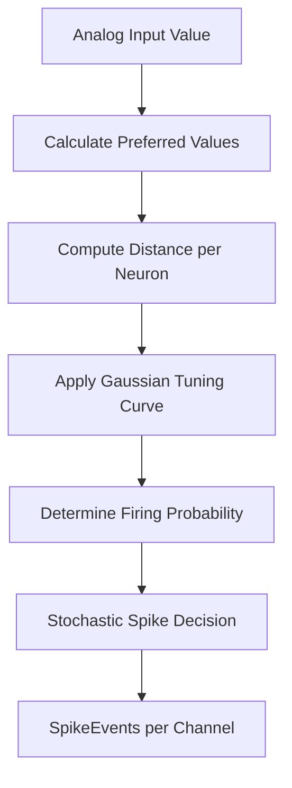
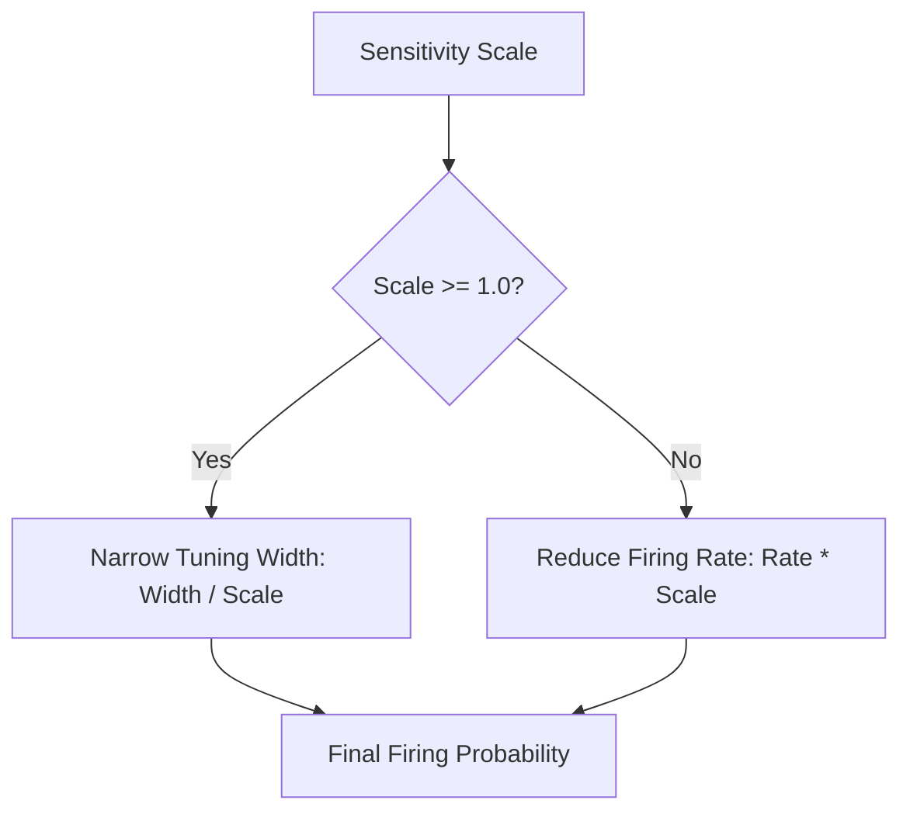

<details>
<summary>Relevant source files</summary>

The following files were used as context for generating this wiki page:

- [src/encoders/population.rs](src/encoders/population.rs)
- [examples/population_encoding.rs](examples/population_encoding.rs)
- [README.md](README.md)
- [tests/serde_tests.rs](tests/serde_tests.rs)
- [benches/allocations.rs](benches/allocations.rs)
- [benches/encoders.rs](benches/encoders.rs)
</details>

# Population Encoder

The `PopulationEncoder` is a sensory encoding module designed to convert continuous analog values into distributed spike patterns across a group of neurons. Unlike direct rate encoding, each neuron in a population is "tuned" to a specific preferred value within the input range. This creates a robust, distributed representation where multiple neurons contribute to encoding a single input value, mimicking biological neural populations.

Sources: [src/encoders/population.rs:3-10](src/encoders/population.rs#L3-L10), [README.md:25-26](README.md#L25-L26)

## Architecture and Mathematical Model

The encoder operates by assigning each neuron in the population a "preferred value" distributed linearly across the defined input range. When an input is processed, each neuron's firing rate is determined by a Gaussian tuning curve.

### Tuning Curve Logic
The response of a neuron $i$ is calculated based on its distance from the input value:
1.  **Preferred Value**: $preferred\_value[i] = range\_min + \frac{i}{num\_neurons} \times (range\_max - range\_min)$
2.  **Distance**: $distance = |input - preferred\_value[i]|$
3.  **Firing Rate**: $rate = \exp\left(\frac{-distance^2}{2 \times tuning\_width^2}\right)$
4.  **Spike Generation**: A spike is emitted if $random() < rate$.

Sources: [src/encoders/population.rs:13-18](src/encoders/population.rs#L13-L18), [src/encoders/population.rs:77-85](src/encoders/population.rs#L77-L85)

### Data Flow Diagram
The following diagram illustrates the transformation of a single analog input into a set of spike events across the neural population.



The diagram shows the internal logic where a single input is mapped to multiple channel-specific firing probabilities.
Sources: [src/encoders/population.rs:77-113](src/encoders/population.rs#L77-L113)

## Components and Configuration

The `PopulationEncoder` is defined by its population size, the range of values it covers, and the breadth of individual neuron responses.

### Key Data Structures

| Field | Type | Description |
| :--- | :--- | :--- |
| `num_neurons` | `usize` | Number of neurons in the population per input channel. |
| `input_range` | `(f32, f32)` | The (min, max) bounds of the analog input signal. |
| `tuning_width` | `f32` | Controls the spread of the Gaussian; larger values mean wider neuron response. |

Sources: [src/encoders/population.rs:32-37](src/encoders/population.rs#L32-L37)

### Implementation Traits
The encoder implements the core `Encoder` trait and the `ModulatedEncoder` trait, allowing it to integrate with neuromodulation systems to adjust sensitivity and gain dynamically.

*  **`encode(&mut self, input: &[f32])`**: Encodes the first value of the input slice into a probabilistic spike train.
*  **`reset()`**: Resets the encoder (stateless for this specific implementation).
*  **`encode_with_gains()`**: Adjusts the effective tuning width and firing rate based on external sensitivity scales.

Sources: [src/encoders/population.rs:141-164](src/encoders/population.rs#L141-L164)

## Neuromodulation and Sensitivity

The `PopulationEncoder` supports dynamic scaling of its response through sensitivity gains. This simulates the effect of neuromodulators (like dopamine or acetylcholine) on neural selectivity.



This diagram represents how sensitivity affects the encoder: high sensitivity narrows the Gaussian (increasing selectivity), while low sensitivity suppresses overall activity.
Sources: [src/encoders/population.rs:94-113](src/encoders/population.rs#L94-L113)

### Effective Tuning Width Calculation
If the `sensitivity_scale` is $\geq 1.0$, the tuning width is narrowed ($width / scale$), making neurons more selective. If the scale is between $0.0$ and $1.0$, the base width is maintained, and the firing rate is suppressed instead to prevent universal firing.

Sources: [src/encoders/population.rs:94-106](src/encoders/population.rs#L94-L106)

## Usage Example

The following snippet demonstrates initializing a population of 20 neurons to encode values between 0.0 and 100.0.

```rust
// Create a population encoder
// num_neurons = 20, input_range = (0.0, 100.0), tuning_width = 10.0
let mut encoder = PopulationEncoder::try_new(20, (0.0, 100.0), 10.0)
    .expect("valid configuration");

let input = [50.0];
let output = encoder.encode(&input);

// Neurons near index 10 (middle of 0-100) are most likely to spike
for spike in output.spikes {
    println!("Spike on channel: {}", spike.channel);
}
```

Sources: [examples/population_encoding.rs:18-21](examples/population_encoding.rs#L18-L21), [src/encoders/population.rs:168-180](src/encoders/population.rs#L168-L180)

## Validation and Serialization

The encoder includes strict validation via `try_new` and supports serialization via `serde`.

*  **Constraints**: `num_neurons` must be positive and within `u16::MAX`. `tuning_width` must be finite and positive. `input_range` must be a valid non-zero span.
*  **Serialization**: When the `serde` feature is enabled, the encoder can be serialized/deserialized, maintaining its configuration across system boundaries.

Sources: [src/encoders/population.rs:50-68](src/encoders/population.rs#L50-L68), [tests/serde_tests.rs:56-59](tests/serde_tests.rs#L56-L59)

## Summary

The `PopulationEncoder` provides a biologically-inspired method for representing continuous data. By utilizing Gaussian tuning curves and distributed firing across a population, it ensures that analog signals are translated into sparse but informative event-based signals suitable for Spiking Neural Networks. Its integration with neuromodulation allows for high-level control over encoding precision and responsiveness.

Sources: [src/encoders/population.rs:3-22](src/encoders/population.rs#L3-L22), [README.md:83-85](README.md#L83-L85)
