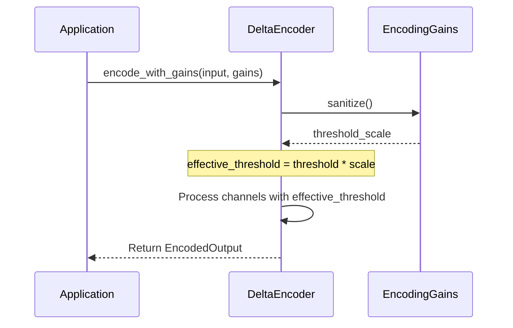

<details>
<summary>Relevant source files</summary>

The following files were used as context for generating this wiki page:

- [src/encoders/delta.rs](src/encoders/delta.rs)
- [examples/delta\_encoding.rs](examples/delta_encoding.rs)
- [src/encoders/mod.rs](src/encoders/mod.rs)
- [README.md](README.md)
- [tests/serde\_tests.rs](tests/serde_tests.rs)
- [benches/allocations.rs](benches/allocations.rs)

</details>

# Delta Encoder

The `DeltaEncoder` is a simple and efficient sensory encoding algorithm designed for Spiking Neural Networks (SNNs). It translates continuous, real-world data into discrete spike events by monitoring changes in the input signal. Specifically, it fires a spike only when the absolute difference between the current input value and the last value that triggered a spike exceeds a predefined threshold. Sources: [README.md:24](README.md#L24), [src/encoders/delta.rs:3-6](src/encoders/delta.rs#L3-L6)

This encoder is particularly effective for event-based processing where the importance of data lies in its changes rather than its absolute magnitude. By only emitting spikes during signal fluctuations, the `DeltaEncoder` can significantly reduce power consumption and data bandwidth in neuromorphic systems. Sources: [src/encoders/delta.rs:13-17](src/encoders/delta.rs#L13-L17)

## Architecture and Core Logic

The `DeltaEncoder` operates as a stateful component that tracks the "last encoded value" for every input channel. When new data arrives, it calculates the magnitude of the change. If the change is sufficient, a `SpikeEvent` is generated, and the internal state for that specific channel is updated to the current input value. Sources: [src/encoders/delta.rs:31-33](src/encoders/delta.rs#L31-L33), [src/encoders/delta.rs:72-85](src/encoders/delta.rs#L72-L85)

### Mathematical Model

The logic follows a straightforward absolute difference comparison:

```text
delta = |current_value - last_value|
spike if delta > threshold
```

If a spike is triggered, the `polarity` of the resulting `SpikeEvent` indicates the direction of the change: `true` for increases and `false` for decreases. Sources: [src/encoders/delta.rs:8-11](src/encoders/delta.rs#L8-L11), [src/encoders/delta.rs:81-83](src/encoders/delta.rs#L81-L83)

### Encoding Data Flow

The following diagram illustrates the internal processing of an input vector through the `DeltaEncoder`.

```mermaid
flowchart TD
    In[Input Slice] --> Loop{For each channel}
    Loop --> Calc[delta = |input - last_val|]
    Calc --> Check{delta > threshold?}
    Check -- Yes --> Spike[Push SpikeEvent]
    Spike --> Update[Set last_val = input]
    Update --> Next[Next Channel]
    Check -- No --> Next
    Next --> Loop
    Loop -- Done --> Out[Return EncodedOutput]
```

The encoder iterates through input channels, compares them against stored state, and updates state only when the threshold is breached. Sources: [src/encoders/delta.rs:72-88](src/encoders/delta.rs#L72-L88)

## Components and Configuration

The `DeltaEncoder` is defined by its internal state and its sensitivity threshold.

### Data Structures

| Field | Type | Description |
|-------|------|-------------|
| `last_values` | `Vec<f32>` | Persistent state storing the value that triggered the last spike for each channel. |
| `threshold` | `f32` | The minimum magnitude of change required to trigger a spike. |

Sources: [src/encoders/delta.rs:25-28](src/encoders/delta.rs#L25-L28)

### Key API Functions

| Function | Description |
|----------|-------------|
| `try_new(threshold, num_channels)` | Recommended fallible constructor that validates parameters (e.g., non-negative threshold). |
| `new(threshold, num_channels)` | Legacy constructor that panics on invalid configuration. |
| `encode(input)` | Processes a slice of values and returns spikes for channels exceeding the threshold. |
| `reset()` | Clears the internal state by resetting `last_values` to 0.0. |
| `encode_deltas_to_spikes(deltas, threshold)` | A stateless utility function returning a boolean spike train from raw delta values. |

Sources: [src/encoders/delta.rs:36-41](src/encoders/delta.rs#L36-L41), [src/encoders/delta.rs:114-116](src/encoders/delta.rs#L114-L116), [src/encoders/delta.rs:134-142](src/encoders/delta.rs#L134-L142), [src/encoders/delta.rs:149-151](src/encoders/delta.rs#L149-L151)

## Modulator Integration

The `DeltaEncoder` supports neuromodulation through the `ModulatedEncoder` trait. This allows external factors (like "dopamine" or "acetylcholine" signals) to dynamically scale the encoding threshold. Sources: [src/encoders/delta.rs:144-148](src/encoders/delta.rs#L144-L148)



When modulated, the `effective_threshold` is calculated as `(self.threshold * threshold_scale).max(0.0)`. This enables higher or lower sensitivity based on global network states. Sources: [src/encoders/delta.rs:66-67](src/encoders/delta.rs#L66-L67), [src/encoders/delta.rs:145-147](src/encoders/delta.rs#L145-L147)

## Implementation Example

The following code demonstrates basic initialization and the stateful nature of the encoder.

```rust
// Create a delta encoder with threshold 3.0 and 2 channels
let mut encoder = DeltaEncoder::try_new(3.0, 2).expect("valid DeltaEncoder");

// Input sequence
let readings = vec![
    [0.0, 10.0], // Initial state (assumed 0.0) -> Ch1 spikes (10 > 3)
    [1.0, 10.5], // Ch0 change (1.0) < 3.0, Ch1 change (0.5) < 3.0 -> No spikes
    [5.0, 10.2], // Ch0 change (4.0) > 3.0 -> Spike on Ch0
];

for input in readings {
    let output = encoder.encode(&input);
    // output contains SpikeEvents for channels that exceeded threshold
}
```

Sources: [examples/delta_encoding.rs:17-31](examples/delta_encoding.rs#L17-L31)

## Performance and Validation

The `DeltaEncoder` is designed to be lightweight with minimal allocations. In benchmarks, it is tested across various scales (256, 1024, and 10,000 channels) to ensure linear performance. Sources: [benches/allocations.rs:120-128](benches/allocations.rs#L120-L128), [benches/encoders.rs:77-85](benches/encoders.rs#L77-L85)

### Validation Rules
- **Threshold**: Must be finite and non-negative. A threshold of `0.0` is valid and means any non-zero change triggers a spike.
- **Channel Count**: The number of channels must fit within a `u16` address space for spike reporting.
- **Serialization**: Supports `serde` for state persistence, including validation during deserialization to ensure stored `last_values` are finite.

Sources: [src/encoders/delta.rs:43-46](src/encoders/delta.rs#L43-L46), [src/encoders/delta.rs:104-106](src/encoders/delta.rs#L104-L106), [tests/serde_tests.rs:204-210](tests/serde_tests.rs#L204-L210)

## Conclusion

The `DeltaEncoder` provides a fundamental mechanism for temporal edge detection in SNNs. By leveraging a stateful threshold-based logic, it effectively filters redundant information in signal streams, providing a high-performance bridge between analog sensors and spiking architectures. Sources: [README.md:24-25](README.md#L24-L25), [src/encoders/delta.rs:13-17](src/encoders/delta.rs#L13-L17)
