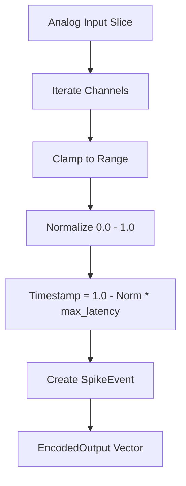
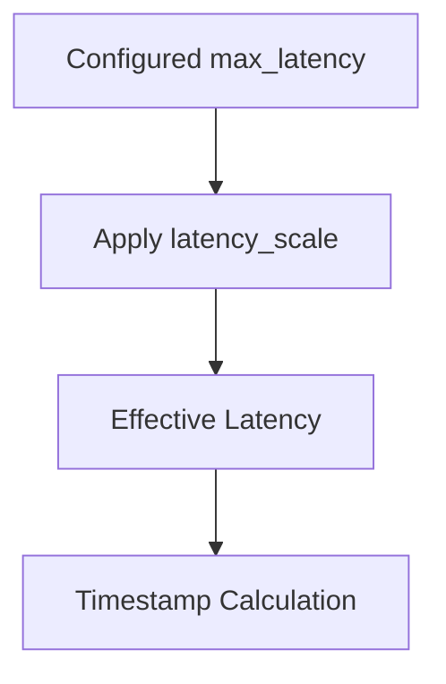

<details>
<summary>Relevant source files</summary>

The following files were used as context for generating this wiki page:

- [src/encoders/latency.rs](src/encoders/latency.rs)
- [examples/latency\_encoding.rs](examples/latency_encoding.rs)
- [src/encoder.rs](src/encoder.rs)
- [src/encoders/mod.rs](src/encoders/mod.rs)
- [README.md](README.md)
- [tests/serde\_tests.rs](tests/serde_tests.rs)
</details>

# Latency Encoder

The `LatencyEncoder` is a core sensory encoding module within the `axon-encoder` library designed to translate continuous analog signals into temporal spike patterns for Spiking Neural Networks (SNNs). Its primary mechanism is **latency coding**, where the strength of an input signal determines the relative timing of a spike within a fixed temporal window. Stronger inputs result in earlier spikes (low latency), while weaker inputs result in later spikes (high latency).

This encoder is stateless and deterministic, producing exactly one positive spike per input channel for each encoding step. It is particularly effective for translating sensor readings or control signals where the relative importance of a signal is mapped to how quickly a neuron reacts to it.

Sources: [README.md:20-20](README.md#L20), [src/encoders/latency.rs:9-12](src/encoders/latency.rs#L9-L12)

## Architecture and Core Logic

The `LatencyEncoder` operates by mapping an input value within a specified `f32` range to a `u64` timestamp. The maximum possible timestamp is defined by the `max_latency` parameter.

### Mathematical Mapping
The transformation follows a linear inverse relationship between input strength and time:
1.  **Normalization**: The input value is clamped to the configured `range` and normalized to a value between `0.0` (min) and `1.0` (max).
2.  **Latency Calculation**: The timestamp is calculated as `(1.0 - normalized) * max_latency`.

Values exceeding the range maximum are mapped to timestamp `0` (instant firing), while values below the range minimum or `NaN` values are mapped to `max_latency` (latest possible firing).

Sources: [src/encoders/latency.rs:10-15](src/encoders/latency.rs#L10-L15), [src/encoders/latency.rs:40-54](src/encoders/latency.rs#L40-L54)

### Data Flow Diagram
The following diagram illustrates how an analog input vector is processed into `SpikeEvent` structures.



The diagram shows the sequential transformation of raw analog values into discrete, time-stamped events.
Sources: [src/encoders/latency.rs:56-78](src/encoders/latency.rs#L56-L78), [src/encoders/latency.rs:113-132](src/encoders/latency.rs#L113-L132)

## Configuration and API

The encoder is configured using two primary parameters defined in the `LatencyEncoder` struct.

| Parameter | Type | Description |
| :--- | :--- | :--- |
| `max_latency` | `u64` | The temporal window size; defines the latest possible spike time. |
| `range` | `(f32, f32)` | The expected (min, max) bounds of the input signal. |

Sources: [src/encoders/latency.rs:13-16](src/encoders/latency.rs#L13-L16)

### Key Methods

| Method | Description |
| :--- | :--- |
| `try_new(max_latency, range)` | Fallible constructor. Returns `EncoderError` if range is non-finite or bounds are unordered. |
| `new(max_latency, range)` | Panicking constructor for convenience in scripts/examples. |
| `encode(input)` | Processes a slice of `f32` and returns an `EncodedOutput` containing `SpikeEvent`s. |
| `reset()` | A no-op for this encoder, as it maintains no internal state between calls. |

Sources: [src/encoders/latency.rs:27-38](src/encoders/latency.rs#L27-L38), [src/encoders/latency.rs:113-138](src/encoders/latency.rs#L113-L138)

## Implementation Details

### Structural Definition
The `LatencyEncoder` implements the `Encoder` trait and optional `serde` support for serialization.

```rust
#[derive(Clone, Debug, PartialEq)]
pub struct LatencyEncoder {
    max_latency: u64,
    range: (f32, f32),
}
```

Sources: [src/encoders/latency.rs:13-17](src/encoders/latency.rs#L13-L17), [src/encoders/mod.rs:13-13](src/encoders/mod.rs#L13)

### Integration with Neuromodulators
The encoder supports gain-based modulation via the `ModulatedEncoder` trait. It specifically responds to the `latency_scale` parameter within `EncodingGains`. This scale adjusts the effective `max_latency` dynamically, allowing neuromodulators (like dopamine or cortisol) to compress or expand the temporal window of the spikes.



This diagram highlights how external gain signals can override the static configuration to alter spike timing.
Sources: [src/encoders/latency.rs:56-68](src/encoders/latency.rs#L56-L68), [src/encoders/latency.rs:138-142](src/encoders/latency.rs#L138-L142)

### Serialization Validation
When using the `serde` feature, the encoder performs validation during deserialization to ensure the `range` is valid and `max_latency` is non-negative.

```rust
#[test]
fn test_serde_validation_failures() {
    // LatencyEncoder invalid range (min >= max) must be rejected
    let invalid_latency_json = r#"{
        "max_latency": 5,
        "range": [1.0, 0.5]
    }"#;
    let res: Result<LatencyEncoder, _> = serde_json::from_str(invalid_latency_json);
    assert!(res.is_err());
}
```

Sources: [tests/serde_tests.rs:136-144](tests/serde_tests.rs#L136-L144), [tests/serde_tests.rs:188-193](tests/serde_tests.rs#L188-L193)

## Usage Example

The following code demonstrates basic initialization and encoding using the `LatencyEncoder`.

```rust
use axon_encoder::prelude::*;

fn main() {
    // 12 steps max window, 0.0 to 1.0 range
    let mut encoder = LatencyEncoder::try_new(12, (0.0, 1.0)).unwrap();
    
    // Stronger inputs (0.9) fire early; weaker (0.1) fire late
    let input = [0.1, 0.9];
    let output = encoder.encode(&input);
    
    // Result: Channel 0 timestamp ~11, Channel 1 timestamp ~1
}
```

Sources: [examples/latency_encoding.rs:14-30](examples/latency_encoding.rs#L14-L30)

## Conclusion
The `LatencyEncoder` provides a mathematically robust way to convert analog intensity into temporal precision. By utilizing the `u64` timestamp space, it allows SNNs to process information based on the order of arrival, facilitating efficient event-driven computation and neuromodulation.

Sources: [src/encoders/latency.rs:9-12](src/encoders/latency.rs#L9-L12), [README.md:20-20](README.md#L20)
