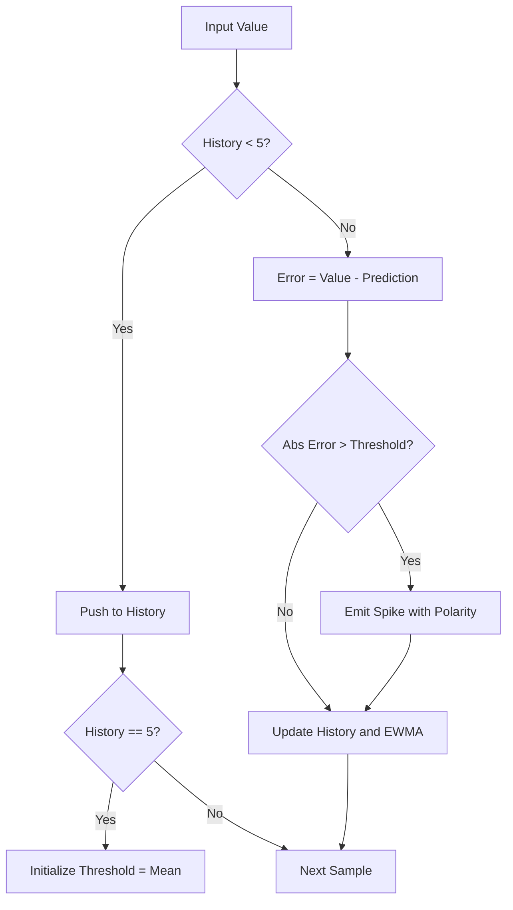
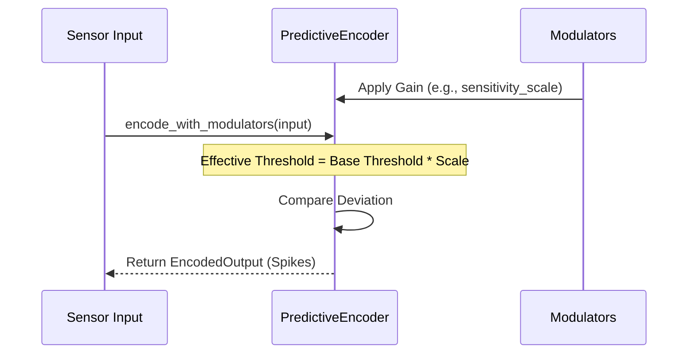

<details>
<summary>Relevant source files</summary>

The following files were used as context for generating this wiki page:

- [src/encoders/predictive.rs](src/encoders/predictive.rs)
- [examples/predictive_encoding.rs](examples/predictive_encoding.rs)
- [src/encoders/mod.rs](src/encoders/mod.rs)
- [README.md](README.md)
- [tests/serde_tests.rs](tests/serde_tests.rs)
- [benches/encoders.rs](benches/encoders.rs)

</details>

# Predictive Encoder

## Introduction
The `PredictiveEncoder` is a specialized sensory encoding module within the `axon-encoder` library designed to translate continuous data into discrete spikes based on causal predictive errors. It functions primarily as an adaptive Exponentially Weighted Moving Average (EWMA) anomaly detector, firing spikes when an input value deviates significantly from an internal predicted baseline. This mechanism is particularly effective for detecting sudden jumps or drops in sensor streams and learning baseline patterns in neuromorphic systems.

Sources: [src/encoders/predictive.rs:43-52](src/encoders/predictive.rs#L43-L52), [README.md:32-34](README.md#L32-L34)

Within the project, the `PredictiveEncoder` is part of a suite of encoders, including the [RateEncoder](#rate-encoder) and [TemporalEncoder](#temporal-encoder), providing a predictive-coding-style approach to signal processing. It generates signed error spikes where positive deviations emit excitatory spikes and negative deviations emit inhibitory spikes.

Sources: [src/encoders/predictive.rs:50-52](src/encoders/predictive.rs#L50-L52), [README.md:28-40](README.md#L28-L40)

## Architecture and Data Flow

### Internal State and Components
The encoder maintains per-channel history and an evolving threshold for each channel. It utilizes a `VecDeque` to store a rolling window of historical values, which is used to calculate predictions and update the adaptive baseline.

Sources: [src/encoders/predictive.rs:77-83](src/encoders/predictive.rs#L77-L83)

| Component | Type | Description |
| :--- | :--- | :--- |
| `history` | `Vec<VecDeque<f32>>` | Rolling window of past values per channel. |
| `thresholds` | `Vec<f32>` | The current predicted baseline (EWMA) for each channel. |
| `history_depth` | `usize` | Maximum size of the history window (minimum 5). |
| `deviation_thresholds` | `Vec<(f32, u16)>` | Pairs of (deviation_limit, spike_value) used to trigger events. |

Sources: [src/encoders/predictive.rs:78-83](src/encoders/predictive.rs#L78-L83)

### The Predictive Loop
The encoding process follows a specific lifecycle: a warm-up phase followed by active prediction and error evaluation. During warm-up (first 5 samples), no spikes are emitted; instead, the history is populated to establish an initial mean.

This flowchart illustrates the logic applied to each input value:



The prediction baseline is updated using the formula: `threshold[i] = 0.9 * threshold[i] + 0.1 * mean(recent_5_samples)`.

Sources: [src/encoders/predictive.rs:56-68](src/encoders/predictive.rs#L56-L68), [src/encoders/predictive.rs:136-168](src/encoders/predictive.rs#L136-L168)

## Core Implementation Details

### Initialization and Validation
The `PredictiveEncoder` provides two primary constructors: `new` (for source compatibility) and `try_new` (returning a unified `EncoderError`). Initialization enforces several constraints to ensure mathematical validity and hardware compatibility.

Sources: [src/encoders/predictive.rs:96-134](src/encoders/predictive.rs#L96-L134)

*  **Minimum History**: `history_depth` must be at least 5.
*  **Channel Limit**: `num_channels` cannot exceed `u16::MAX + 1` (65,536) because spike channel IDs are stored as `u16`.
*  **Finite Thresholds**: Deviation thresholds must be finite and non-negative.

Sources: [src/encoders/predictive.rs:9-25](src/encoders/predictive.rs#L9-L25), [src/encoders/predictive.rs:125-134](src/encoders/predictive.rs#L125-L134)

### Signed Error Spikes
Unlike simple magnitude encoders, the `PredictiveEncoder` preserves the direction of the error. The `SpikeEvent` generated includes a `polarity` boolean:
*  **True (Positive)**: The current value is higher than the prediction.
*  **False (Negative)**: The current value is lower than the prediction.

Sources: [src/encoders/predictive.rs:154-158](src/encoders/predictive.rs#L154-L158), [src/encoders/predictive.rs:273-288](src/encoders/predictive.rs#L273-L288)

## Neuromodulation and Gain Control
The encoder implements the `ModulatedEncoder` trait, allowing its sensitivity to be adjusted dynamically via neuromodulators (e.g., dopamine, acetylcholine). Modulators influence the `threshold_scale`, which effectively shrinks or expands the deviation thresholds.

Sources: [src/encoders/predictive.rs:175-201](src/encoders/predictive.rs#L175-L201), [tests/serde_tests.rs:77-113](tests/serde_tests.rs#L77-L113)



Sources: [src/encoders/predictive.rs:188-201](src/encoders/predictive.rs#L188-L201), [src/encoders/predictive.rs:341-360](src/encoders/predictive.rs#L341-L360)

## Usage Example
The following snippet demonstrates setting up a predictive encoder for anomaly detection in a single-channel sensor stream.

```rust
use axon_encoder::prelude::*;

fn main() {
    // 10-step history, spikes at deviations of 3.0 and 8.0
    let mut encoder = PredictiveEncoder::try_new(10, vec![(3.0, 1), (8.0, 2)], 1)
        .expect("valid PredictiveEncoder");

    let stream = vec![5.0, 5.0, 5.0, 5.0, 5.0, 15.0]; // Normal baseline then anomaly

    for value in stream {
        let output = encoder.encode(&[value]);
        if !output.spikes.is_empty() {
            println!("Anomaly detected!");
        }
    }
}
```

Sources: [examples/predictive_encoding.rs:19-35](examples/predictive_encoding.rs#L19-L35)

## Summary
The `PredictiveEncoder` is a robust tool for event-based anomaly detection and signal compression within Spiking Neural Networks. By maintaining a temporal history and employing an adaptive prediction baseline, it filters out steady-state signals and emphasizes meaningful deviations, providing a biologically-inspired method for processing telemetry and sensor data.

Sources: [README.md:79-92](README.md#L79-L92), [src/encoders/predictive.rs:43-55](src/encoders/predictive.rs#L43-L55)
