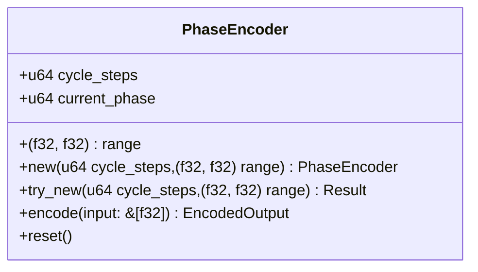
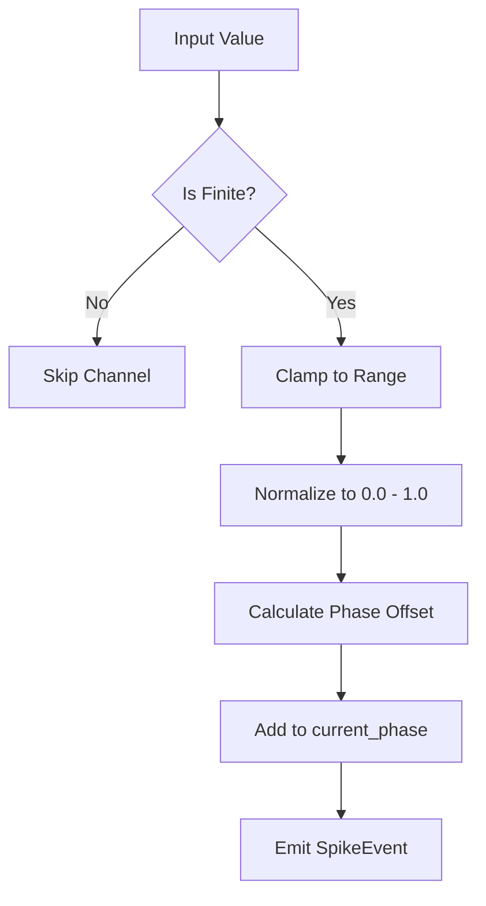
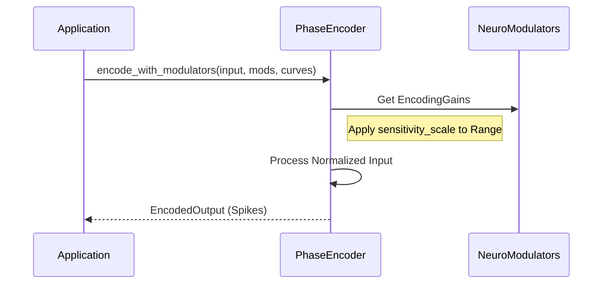

Relevant source files

The following files were used as context for generating this wiki page:

- [src/encoders/phase.rs](src/encoders/phase.rs)
- [src/encoder.rs](src/encoder.rs)
- [README.md](README.md)
- [REVIEW.md](REVIEW.md)
- [tests/serde_tests.rs](tests/serde_tests.rs)
- [src/encoders/rate.rs](src/encoders/rate.rs)

# Phase Encoder

## Introduction
The `PhaseEncoder` is a specialized sensory encoding algorithm within the `axon-encoder` library designed to convert continuous, real-world data into phase-locked spikes. Unlike a [Rate Encoder](#rate-encoder), which encodes value intensity as firing frequency, the `PhaseEncoder` maps normalized input values to specific time offsets (phase bins) within a repeating oscillation cycle.

This encoder ensures that higher input values result in spikes occurring later within the oscillation phase. Each input channel produces at most one positive spike per encoding call, maintaining stable ordering within that call while advancing a global background phase for subsequent calls.

Sources: [src/encoders/phase.rs:3-12](src/encoders/phase.rs#L3-L12), [README.md:21-30](README.md#L21-L30)

## Architecture and Data Structures

### Core Struct: PhaseEncoder
The `PhaseEncoder` maintains its state through three primary fields:
*  `cycle_steps`: Defines the resolution of the oscillation cycle (number of phase bins).
*  `range`: A tuple defining the expected minimum and maximum input values for normalization.
*  `current_phase`: A monotonic counter tracking the absolute background phase time.

Sources: [src/encoders/phase.rs:13-19](src/encoders/phase.rs#L13-L19), [src/encoders/phase.rs:46-53](src/encoders/phase.rs#L46-L53)

### Parameters Summary
| Field | Type | Description | Constraints |
| :--- | :--- | :--- | :--- |
| `cycle_steps` | `u64` | Total bins in one oscillation cycle. | Must be > 0. |
| `range` | `(f32, f32)` | The (min, max) span of expected input values. | Must be finite; min < max. |
| `current_phase` | `u64` | The current absolute timestamp of the oscillation. | Increments every `encode` call. |

Sources: [src/encoders/phase.rs:25-33](src/encoders/phase.rs#L25-L33), [tests/serde_tests.rs:163-167](tests/serde_tests.rs#L163-L167)

## Logic and Data Flow

### Normalization and Phase Mapping
Input values are first clamped and normalized to a `[0.0, 1.0]` range based on the configured `range`. This normalized value is then multiplied by `cycle_steps` to determine the `phase_offset`. The final spike timestamp is calculated by adding the `phase_offset` to the `current_phase`.

Sources: [src/encoders/phase.rs:55-63](src/encoders/phase.rs#L55-L63), [src/encoders/phase.rs:75-92](src/encoders/phase.rs#L75-L92)

### Encoding Process
1.  **Iterate**: The encoder iterates through each value in the input slice.
2.  **Validate**: Non-finite values (NaN/Inf) are skipped to prevent invalid timestamps.
3.  **Timestamp Calculation**: `timestamp = current_phase + ((normalized_value * cycle_steps).floor())`.
4.  **Advance**: After processing the entire input slice, `current_phase` is incremented by 1.
5.  **Ordering**: Within a single call, a channel with a higher value will always have a later timestamp than a channel with a lower value.

Sources: [src/encoders/phase.rs:65-95](src/encoders/phase.rs#L65-L95), [src/encoders/phase.rs:135-139](src/encoders/phase.rs#L135-L139)

## Neuromodulation
The `PhaseEncoder` implements the `ModulatedEncoder` trait, allowing its sensitivity to be adjusted dynamically via neuromodulators (e.g., dopamine, acetylcholine). 

### Sensitivity Scaling
When modulated, the encoder uses a `sensitivity_scale` to adjust its input range effectively. A scale of `0.0` or non-finite scales will suppress all output, while positive scales shrink or expand the window of values that map to the phase cycle.

Sources: [src/encoders/phase.rs:104-124](src/encoders/phase.rs#L104-L124), [src/encoders/phase.rs:149-155](src/encoders/phase.rs#L149-L155), [src/encoders/rate.rs:138-142](src/encoders/rate.rs#L138-L142)

## Serialization
When the `serde` feature is enabled, `PhaseEncoder` supports serialization and deserialization. The implementation includes strict validation to ensure that `cycle_steps` remains positive and the `range` remains valid upon restoration.

Sources: [tests/serde_tests.rs:155-159](tests/serde_tests.rs#L155-L159), [src/encoders/phase.rs:161-179](src/encoders/phase.rs#L161-L179)

## Summary
The `PhaseEncoder` provides a deterministic, oscillation-based mapping of analog signals into the temporal domain. By representing values as phase offsets, it allows Spiking Neural Networks to process information based on the relative timing of spikes within a cycle. It is fully integrated with the library's neuromodulation system and state management protocols, including `reset` functionality to restore the `current_phase` to zero.

Sources: [src/encoders/phase.rs:141-143](src/encoders/phase.rs#L141-L143), [REVIEW.md:124-126](REVIEW.md#L124-L126)
