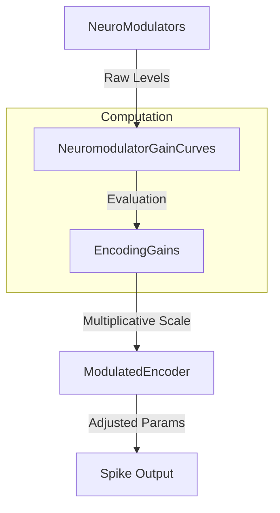
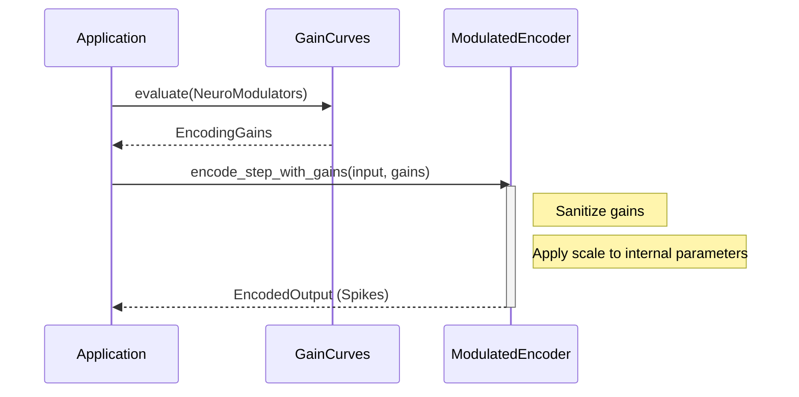

Relevant source files

The following files were used as context for generating this wiki page:

- [src/modulators.rs](src/modulators.rs)
- [src/lib.rs](src/lib.rs)
- [src/encoders/rate.rs](src/encoders/rate.rs)
- [src/encoders/population.rs](src/encoders/population.rs)
- [src/encoders/phase.rs](src/encoders/phase.rs)
- [src/encoders/latency.rs](src/encoders/latency.rs)
- [src/encoders/predictive.rs](src/encoders/predictive.rs)
- [tests/serde_tests.rs](tests/serde_tests.rs)

# Neuromodulation & Gain Curves

Neuromodulation in the `axon-encoder` library provides a mechanism to dynamically adjust the behavior of sensory encoders based on simulated chemical or physiological signals. By utilizing "Gain Curves," the system translates raw modulator levels (e.g., dopamine, cortisol) into multiplicative scales that affect specific encoder parameters like firing rates, thresholds, and latency.

This system is integrated via the `ModulatedEncoder` trait, allowing encoders to process continuous analog values while simultaneously responding to the shifting internal state of a neuromorphic system. This enables complex behaviors such as adaptive sensitivity, urgency-based firing, and homeostatic regulation within Spiking Neural Networks (SNNs).
Sources: [src/lib.rs:36-45](src/lib.rs#L36-L45), [src/modulators.rs:163-176](src/modulators.rs#L163-L176)

## Architecture Overview

The neuromodulation system is built on a hierarchy of data structures that map raw modulator values to specific physical effects on encoding algorithms.

### Core Data Structures

| Structure | Description |
| :--- | :--- |
| `NeuroModulators` | Container for raw levels of dopamine, cortisol, acetylcholine, and tempo. |
| `GainCurve` | Maps a specific modulator level to a gain multiplier using linear interpolation. |
| `ModulatorGainCurves` | A set of `GainCurve` mappings for a single modulator, targeting different encoding parameters. |
| `NeuromodulatorGainCurves` | The master configuration mapping all four modulators to their respective gain curves. |
| `EncodingGains` | The final resulting scales (multipliers) applied to an encoder's logic. |

Sources: [src/modulators.rs:19-24](src/modulators.rs#L19-L24), [src/modulators.rs:37-40](src/modulators.rs#L37-L40), [src/modulators.rs:141-146](src/modulators.rs#L141-L146), [src/modulators.rs:152-161](src/modulators.rs#L152-L161), [src/modulators.rs:205-212](src/modulators.rs#L205-L212)

### Modulation Data Flow
The following diagram illustrates how raw neuro-signals are transformed into the final scalars used during the encoding process.

Sources: [src/modulators.rs:215-225](src/modulators.rs#L215-L225), [src/lib.rs:56-78](src/lib.rs#L56-L78)

## Gain Curves and Interpolation

A `GainCurve` defines a mapping from an `input_range` (modulator level) to an `output_range` (multiplier). It uses linear interpolation (lerp) to determine the multiplier for a given level.

*  **Identity:** Returns a constant gain of 1.0, regardless of the input.
*  **Evaluation:** Levels outside the `input_range` are clamped. If the ranges are invalid or non-finite, it defaults to a gain of 1.0 for stability.
*  **Sanitization:** All calculated gains are clamped between `MIN_GAIN_SCALE` (0.0) and `MAX_GAIN_SCALE` (10,000.0) to prevent numerical instability.

Sources: [src/modulators.rs:7-8](src/modulators.rs#L7-L8), [src/modulators.rs:55-59](src/modulators.rs#L55-L59), [src/modulators.rs:71-92](src/modulators.rs#L71-L92)

### Mathematical Evaluation
The gain is calculated as:
`clamped_level = level.clamp(input_min, input_max)`
`position = (clamped_level - input_min) / (input_max - input_min)`
`scale = output_min * (1.0 - position) + output_max * position`
Sources: [src/modulators.rs:80-87](src/modulators.rs#L80-L87)

## Modulator Types and Decay

The system tracks four primary modulators, each with a specific decay rate applied via the `decay()` method to simulate biological reuptake or dissipation.

| Modulator | Decay Rate | Description |
| :--- | :--- | :--- |
| `dopamine` | 0.95 | Often associated with reward or prediction error. |
| `cortisol` | 0.90 | Associated with stress or high-alert states. |
| `acetylcholine` | 0.99 | Associated with attention and learning. |
| `tempo` | 0.98 | Influences timing and latency. |

Sources: [src/modulators.rs:1-4](src/modulators.rs#L1-L4), [src/modulators.rs:27-33](src/modulators.rs#L27-L33)

## Application to Encoders

Encoders implement `ModulatedEncoder` to utilize `EncodingGains`. The physical meaning of a gain depends on the encoder's specific algorithm.

### Zero-Gain Semantics
Gains of 0.0 have specific physical interpretations:
*  **Threshold Scale (0.0):** Maximum sensitivity; any non-zero input triggers a spike.
*  **Sensitivity Scale (0.0):** Output suppression; no spikes are generated.
*  **Firing Rate Scale (0.0):** Complete silence; firing probability/accumulation is zeroed.
*  **Latency Scale (0.0):** Instant response; all spikes occur at timestamp 0.

Sources: [src/modulators.rs:163-176](src/modulators.rs#L163-L176)

### Encoder-Specific Implementations

| Encoder | Component Affected | Implementation Logic |
| :--- | :--- | :--- |
| `RateEncoder` | `firing_rate_scale` | Scales the effective Hz. If scale is $\le 0$ or non-finite, the encoder is silenced and backlogs are cleared. |
| `PopulationEncoder`| `sensitivity_scale` | Scales the Gaussian tuning width (for gains $\ge 1$) or reduces firing rate (for gains $< 1$). |
| `PhaseEncoder` | `sensitivity_scale` | Shrinks the input range, effectively making the encoder more sensitive to small changes. |
| `LatencyEncoder` | `latency_scale` | Scales the `max_latency` parameter, moving spike times closer to 0 as scale decreases. |
| `PredictiveEncoder`| `threshold_scale` | Multiplies the `deviation_threshold`, requiring more or less error to fire a spike. |

Sources: [src/encoders/rate.rs:172-205](src/encoders/rate.rs#L172-L205), [src/encoders/population.rs:76-107](src/encoders/population.rs#L76-L107), [src/encoders/phase.rs:105-132](src/encoders/phase.rs#L105-L132), [src/encoders/latency.rs:59-78](src/encoders/latency.rs#L59-L78), [src/encoders/predictive.rs:136-170](src/encoders/predictive.rs#L136-L170)

### Modulated Step Sequence
The sequence below shows how a streaming step is processed with modulation.

Sources: [src/lib.rs:70-78](src/lib.rs#L70-L78), [src/modulators.rs:215-225](src/modulators.rs#L215-L225)

## Serialization

The modulation system supports `serde` for saving and loading states.
*  `GainCurve` validation is enforced during deserialization, ensuring `input_range` min is less than max and all values are finite.
*  `EncodingGains` provides default values of 1.0 if specific scales are missing in the serialized data.
*  `NeuroModulators` round-trip through JSON/Bincode maintains precision for decay operations.

Sources: [src/modulators.rs:94-124](src/modulators.rs#L94-L124), [src/modulators.rs:188-202](src/modulators.rs#L188-L202), [tests/serde_tests.rs:75-125](tests/serde_tests.rs#L75-L125)

## Conclusion

The Neuromodulation and Gain Curve system provides a robust framework for adaptive sensory encoding. By separating the biological signal simulation (`NeuroModulators`) from the mathematical mapping (`GainCurve`) and the specific encoder logic (`ModulatedEncoder`), the library allows for complex, multi-modal control of spike generation. This enables SNNs to react dynamically to changing environments and internal states with high numerical stability and precise temporal control.
