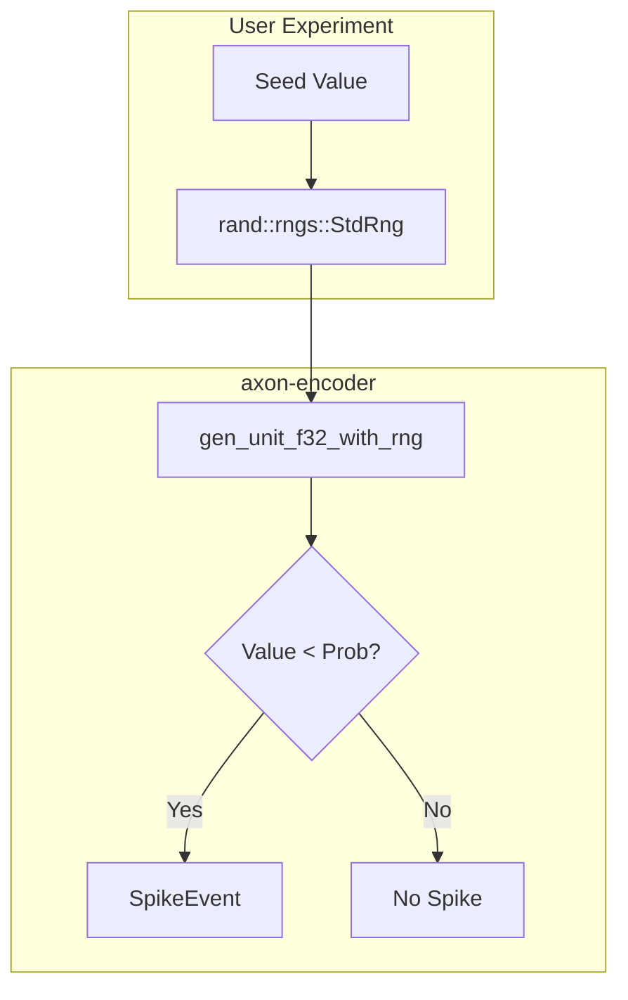
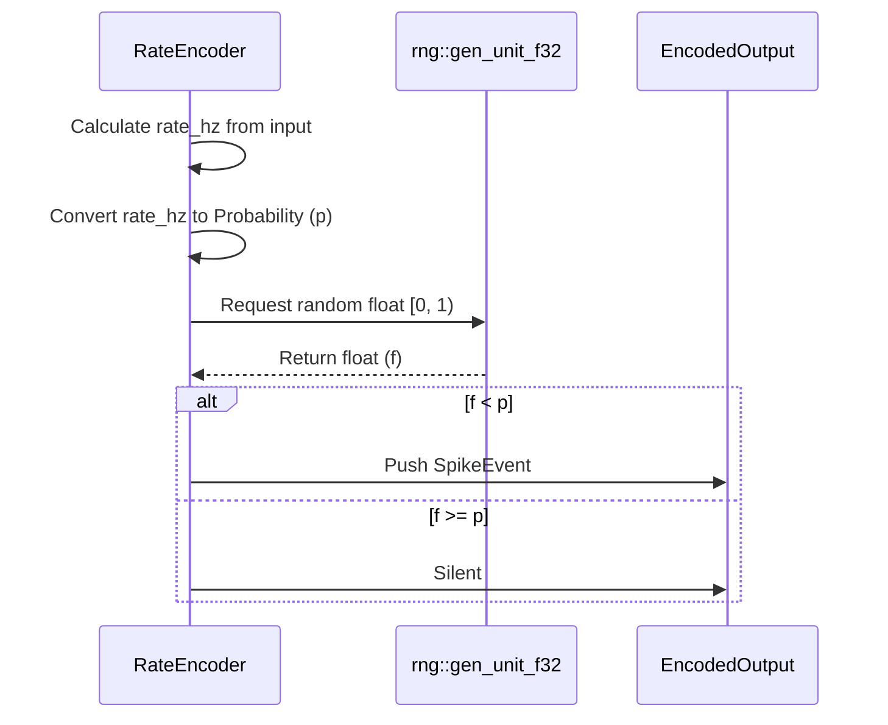

<details>
<summary>Relevant source files</summary>

The following files were used as context for generating this wiki page:

- [src/rng.rs](src/rng.rs)
- [README.md](README.md)
- [src/poisson.rs](src/poisson.rs)
- [src/encoders/rate.rs](src/encoders/rate.rs)
- [src/encoders/population.rs](src/encoders/population.rs)
- [src/modulators.rs](src/modulators.rs)
</details>

# Stochasticity & RNG Management

Stochasticity is a core component of the `axon-encoder` library, primarily used in encoders that sample spikes probabilistically to mimic biological neural firing patterns. The system provides a centralized Random Number Generation (RNG) utility that supports both non-reproducible thread-local sampling and seeded, reproducible experimentation. This functionality is critical for the `RateEncoder`, `PopulationEncoder`, and `PoissonEncoder` modules, which translate continuous analog values into event-based spike trains through probability distributions.

The RNG management system is designed for sensory and spike sampling rather than cryptographic use. It utilizes the `rand` crate, backed by OS entropy via `getrandom`. For web-based environments (WebAssembly), the library requires a working `getrandom` backend to provide entropy for these stochastic processes.

Sources: [README.md:54-68](README.md#L54-L68), [src/rng.rs:1-12](src/rng.rs#L1-L12)

## RNG Core Architecture

The system abstracts random number generation through the `axon_encoder::rng` module. It provides high-level helpers to generate floating-point values in the unit range `[0, 1)`, which are then compared against calculated probabilities to determine if a spike event should be triggered.

### Primary RNG Interfaces

| Function | Description | Return Type |
| :--- | :--- | :--- |
| `gen_unit_f32()` | Uses a thread-local generator (`ThreadRng`). Sequences are not reproducible across runs. | `f32` |
| `gen_unit_f32_with_rng(&mut R)` | Accepts a caller-provided RNG (e.g., `StdRng`). Enables reproducible, deterministic sequences. | `f32` |

Sources: [src/rng.rs:18-32](0, 1)`, which are then compared against calculated probabilities to determine if a spike event should be triggered.

### Primary RNG Interfaces

| Function | Description | Return Type |
| :--- | :--- | :--- |
| `gen_unit_f32()` | Uses a thread-local generator (`ThreadRng`). Sequences are not reproducible across runs. | `f32` |
| `gen_unit_f32_with_rng(&mut R)` | Accepts a caller-provided RNG (e.g., `StdRng`). Enables reproducible, deterministic sequences. | `f32` |

Sources: [src/rng.rs:18-32), [README.md:58-63](README.md#L58-L63)

### Deterministic Flow for Experiments
The following diagram illustrates how the library supports reproducible experiments by allowing users to inject seeded generators into the encoding pipeline.



The use of `gen_unit_f32_with_rng` ensures that for a given seed and algorithm, the resulting spike train remains identical across executions.
Sources: [src/rng.rs:77-106](src/rng.rs#L77-L106), [README.md:60-63](README.md#L60-L63)

## Poisson Spike Generation

The `PoissonEncoder` and related utilities in `src/poisson.rs` provide the mathematical foundation for rate-based stochasticity. It converts physical firing rates (Hz) and time steps (seconds) into per-bin spike probabilities.

### Rate-to-Probability Transformation
The library uses a homogeneous Poisson process model where the probability of a spike in a time bin is calculated as:
$P = 1 - e^{-(\text{rate\_hz} \times \text{dt\_seconds})}$

To maintain accuracy for tiny products of rate and time, the implementation utilizes `exp_m1` (calculating $e^x - 1$ directly) to prevent rounding to zero in `f32`.

```rust
pub fn probability_from_rate_hz(rate_hz: f32, dt_seconds: f32) -> f32 {
    if !rate_dt_produces_spikes(rate_hz, dt_seconds) {
        return 0.0;
    }
    let x = rate_hz * dt_seconds;
    (-(-x).exp_m1()).clamp(0.0, 1.0)
}
```

Sources: [src/poisson.rs:1-60](src/poisson.rs#L1-L60)

## Stochastic Encoder Implementations

### RateEncoder (Batch Mode)
In batch mode, the `RateEncoder` generates independent probabilistic spikes for each call. It maps input intensity to a firing rate and then uses the RNG to decide if a spike occurs.



Sources: [src/encoders/rate.rs:9-25](0, 1)
  R-->>E: Return float (f)
  alt f < p
  E->>O: Push SpikeEvent
  else f >= p
  E->>O: Silent
  end
```
Sources: [src/encoders/rate.rs:9-25), [src/encoders/rate.rs:152-180](src/encoders/rate.rs#L152-L180)

### PopulationEncoder
The `PopulationEncoder` uses stochastic sampling to simulate a population of neurons with overlapping Gaussian tuning curves. The firing rate of each neuron is determined by its proximity to the input value relative to its "preferred" tuning center.

- **Gaussian Tuning**: $rate = \exp\left(-\frac{\text{distance}^2}{2 \times \text{tuning\_width}^2}\right)$
- **Sampling**: A spike is generated if `rng.gen() < rate`.

Sources: [src/encoders/population.rs:13-25](src/encoders/population.rs#L13-L25), [src/encoders/population.rs:104-126](src/encoders/population.rs#L104-L126)

## Neuromodulation and Gain Control

Stochasticity is further influenced by `NeuroModulators` (Dopamine, Cortisol, Acetylcholine, Tempo). These factors modify the internal firing probabilities by scaling rates or sensitivities through `GainCurve` evaluations.

| Modulator | Typical Influence in System | Decay Rate |
| :--- | :--- | :--- |
| Dopamine | Firing Rate / Threshold Scale | 0.95 |
| Cortisol | Threshold Scale | 0.90 |
| Acetylcholine | Firing Rate Scale | 0.99 |
| Tempo | Sensitivity / Latency Scale | 0.98 |

Sources: [src/modulators.rs:1-35](src/modulators.rs#L1-L35), [src/modulators.rs:145-165](src/modulators.rs#L145-L165)

## Summary of Stochastic Safety
The library implements several guards to ensure RNG stability:
1. **Silence on Non-Finite**: Rates or probabilities that are `NaN` or `Infinity` result in 0.0 probability (silence) rather than undefined behavior or panics.
2. **Clamping**: All probabilities are clamped to the `[0.0, 1.0]` range.
3. **Gain Sanitization**: Gains produced by neuromodulators are clamped between `0.0` and `10,000.0` to prevent numerical instability in probability calculations.

Sources: [src/modulators.rs:10-17](src/modulators.rs#L10-L17), [src/encoders/rate.rs:355-375](src/encoders/rate.rs#L355-L375), [src/poisson.rs:145-160](src/poisson.rs#L145-L160)
