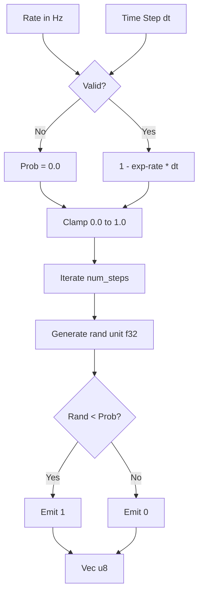
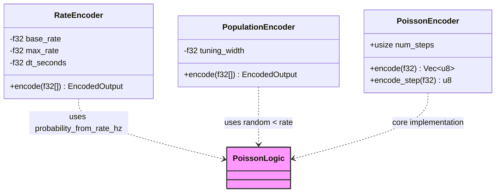

<details>
<summary>Relevant source files</summary>

The following files were used as context for generating this wiki page:

- [src/poisson.rs](src/poisson.rs)
- [src/encoders/rate.rs](src/encoders/rate.rs)
- [README.md](README.md)
- [src/encoders/population.rs](src/encoders/population.rs)
- [tests/serde_tests.rs](tests/serde_tests.rs)
- [benches/allocations.rs](benches/allocations.rs)
</details>

# Poisson Spike Generation

Poisson Spike Generation in the `axon-encoder` project provides a stochastic mechanism for converting continuous values or physical firing rates into discrete spike trains. This module is essential for creating baseline spike trains with controllable average rates and supporting stochastic encoders like the `RateEncoder` and `PopulationEncoder`. It bridges the gap between analog intensities and the event-driven requirements of Spiking Neural Networks (SNNs).

The system handles both dimensionless probability inputs and physical rates defined in Hertz (Hz). Unlike most encoders in the library, the core `PoissonEncoder` operates on a single input value to generate a temporal spike train over multiple steps, rather than mapping an input vector to a spatial spike output.

## Mathematical Model

The Poisson generation process is governed by two primary modes of input conversion. For probability-based inputs, values are clamped between 0.0 and 1.0, where each time step results in a spike if a randomly generated float in the range `[0, 1)` is less than the input probability. For physical rate inputs, the probability $P$ per time bin is derived using the formula:

$$P = 1 - e^{-(\text{rate\_hz} \times \text{dt\_seconds})}$$

To maintain accuracy for tiny products of rate and time (e.g., high sample rates or low Hz), the implementation utilizes `exp_m1` (calculating $e^x - 1$) to avoid rounding to zero in 32-bit floating-point precision.

Sources: [src/poisson.rs:10-21](0, 1)` is less than the input probability. For physical rate inputs, the probability $P$ per time bin is derived using the formula:

$$P = 1 - e^{-(\text{rate\_hz} \times \text{dt\_seconds})}$$

To maintain accuracy for tiny products of rate and time (e.g., high sample rates or low Hz), the implementation utilizes `exp_m1` (calculating $e^x - 1$) to avoid rounding to zero in 32-bit floating-point precision.

Sources: [src/poisson.rs:10-21), [src/poisson.rs:37-45](src/poisson.rs#L37-L45), [src/encoders/rate.rs:13-17](src/encoders/rate.rs#L13-L17)

## Architecture and Components

### PoissonEncoder Structure
The `PoissonEncoder` is a lightweight struct primarily defined by the number of steps it should generate in a single batch encoding call.

```rust
#[derive(Clone, Debug)]
#[cfg_attr(feature = "serde", derive(serde::Serialize, serde::Deserialize))]
pub struct PoissonEncoder {
    pub num_steps: usize,
}
```

Sources: [src/poisson.rs:31-34](src/poisson.rs#L31-L34), [tests/serde_tests.rs:260-265](tests/serde_tests.rs#L260-L265)

### Data Flow for Spike Generation
The following diagram illustrates the transformation from a physical firing rate into a discrete spike train.



The diagram shows the logic within `probability_from_rate_hz` and the subsequent `encode` loop. Sources: [src/poisson.rs:47-83](src/poisson.rs#L47-L83)

## Key Functions and API

The library provides both standalone utility functions and methods attached to the `PoissonEncoder` struct.

| Function/Method | Parameters | Description |
| :--- | :--- | :--- |
| `probability_from_rate_hz` | `rate_hz: f32`, `dt_seconds: f32` | Converts physical rate and time bin width to a per-bin probability. Returns `0.0` for invalid/non-finite inputs. |
| `encode` | `input: f32` | Generates a `Vec<u8>` of length `num_steps` where each element is 1 (spike) or 0 (no spike) based on the input probability. |
| `encode_step` | `input: f32` | Returns a single `u8` (1 or 0) for streaming scenarios where decisions are made one step at a time. |
| `encode_rate_hz` | `rate_hz: f32`, `dt_seconds: f32` | A wrapper that calculates probability from rate before performing batch encoding. |

Sources: [src/poisson.rs:47-98](src/poisson.rs#L47-L98)

## Stochastic Implementation

Stochastic encoders in `axon-encoder` utilize a centralized RNG approach. By default, `rand::rng()` provides a thread-local generator. For reproducible experiments, users can utilize `gen_unit_f32_with_rng(&mut rng)` to pass a seeded generator.

### Relationship with Other Encoders
While `PoissonEncoder` is standalone, its logic is integrated into other primary encoders to provide stochastic behavior.



Sources: [src/encoders/rate.rs:136-146](src/encoders/rate.rs#L136-L146), [src/encoders/population.rs:109-114](src/encoders/population.rs#L109-L114), [README.md:46-55](README.md#L46-L55)

## Usage Considerations

### Handling Invalid Inputs
The Poisson logic is designed to be "silent" rather than panicking when encountering invalid data. Non-finite (NaN, Infinity) or non-positive rates/time steps result in a probability of `0.0`, effectively silencing the encoder. Negative probabilities passed to `encode` are clamped to `0.0`, and values above `1.0` are clamped to `1.0`.
Sources: [src/poisson.rs:37-52](src/poisson.rs#L37-L52), [src/poisson.rs:125-135](src/poisson.rs#L125-L135)

### Performance and Allocations
The `PoissonEncoder` performs minimal allocations. The `encode` method allocates a `Vec<u8>` proportional to `num_steps`. In benchmarking, increasing the steps significantly impacts the byte count of the result but maintains low allocation frequency.
Sources: [benches/allocations.rs:137-142](benches/allocations.rs#L137-L142)

## Summary

Poisson Spike Generation provides the stochastic foundation for the `axon-encoder` library. By accurately converting physical firing rates (Hz) into time-discrete spike probabilities using the $1 - e^{-x}$ model, it ensures that SNNs can process analog intensities with biological plausibility. Whether used via the standalone `PoissonEncoder` for generating temporal trains or integrated into `RateEncoder` for spatial encoding, the implementation prioritizes numerical stability for tiny time-steps and robust handling of non-finite inputs.
