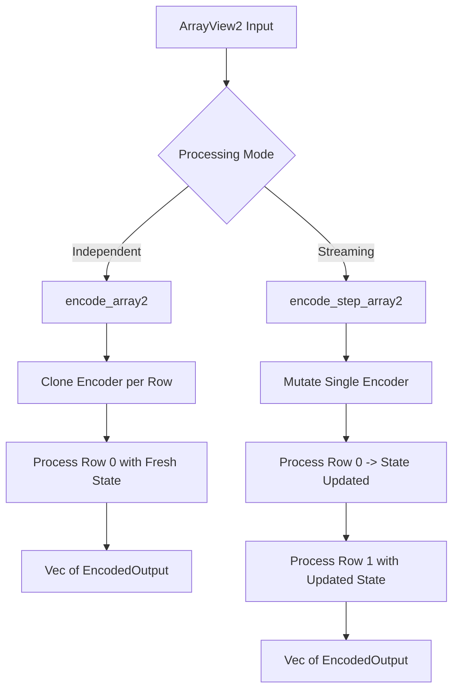

<details>
<summary>Relevant source files</summary>

The following files were used as context for generating this wiki page:

- [src/ndarray_ext.rs](src/ndarray_ext.rs)
- [examples/ndarray_encoding.rs](examples/ndarray_encoding.rs)
- [Cargo.toml](Cargo.toml)
- [src/encoder.rs](src/encoder.rs)
- [README.md](README.md)
- [REVIEW.md](REVIEW.md)

</details>

# Multidimensional Data (NDArray Extension)

The **Multidimensional Data (NDArray Extension)** provides feature-gated integration for the `ndarray` crate, allowing `axon-encoder` to process multidimensional arrays efficiently. This extension facilitates the translation of continuous, dense data structures into sparse spike events required by Spiking Neural Networks (SNNs).

By enabling the `ndarray` feature, encoders gain access to specialized methods for handling `ArrayView1` and `ArrayView2` inputs. This allows for both batch processing of independent samples and streaming processing of continuous data sequences directly from standard Rust scientific computing structures.
Sources: [README.md:23-27](README.md#L23-L27), [src/ndarray_ext.rs:1-5](src/ndarray_ext.rs#L1-L5)

## Architecture and Core Traits

The extension is implemented as a trait, `NdarrayEncoderExt`, which is automatically implemented for any type that already implements the base `Encoder` trait. This design ensures that multidimensional support is available across all encoder types (e.g., `RateEncoder`, `DeltaEncoder`) without modifying their core logic.

### NdarrayEncoderExt Trait
This trait provides the primary interface for ndarray integration. It handles the conversion between `ndarray` views and the standard slices expected by the internal encoding logic.

| Method | Input Type | Description |
| :--- | :--- | :--- |
| `encode_array1` | `ArrayView1` | Encodes a 1D array view as a single input stimulus. |
| `encode_step_array1` | `ArrayView1` | Encodes a 1D array view as a single step in a stream. |
| `encode_array2` | `ArrayView2` | Encodes each row of a 2D array as an independent sample using cloned state. |
| `encode_step_array2` | `ArrayView2` | Encodes each row of a 2D array as a step in a continuous stream, threading state across rows. |

Sources: [src/ndarray_ext.rs:5-48](src/ndarray_ext.rs#L5-L48), [README.md:23-27](README.md#L23-L27)

### Data Flow for 2D Arrays
The extension supports two distinct processing modes for 2D arrays, determined by how state is managed between rows.



This diagram illustrates the difference between independent row processing (where state is isolated) and streaming row processing (where state accumulates).
Sources: [src/ndarray_ext.rs:15-48](src/ndarray_ext.rs#L15-L48)

## Implementation Details

### State Management
The `encode_array2` method requires the encoder to implement the `Clone` trait. This is because each row is treated as a separate sample, and the encoder is snapshotted to ensure that state from one row does not bleed into the next. Conversely, `encode_step_array2` threads a single mutable reference through all rows, making it suitable for temporal data where the sequence of rows represents a continuous signal.
Sources: [src/ndarray_ext.rs:15-48](src/ndarray_ext.rs#L15-L48)

### Performance and Layout
The implementation prioritizes efficiency by using `as_standard_layout()` for 2D arrays. This ensures that the underlying data is in a row-major format, which is the most efficient layout for row-by-row iteration in Rust. If a 1D view is not contiguous (e.g., a slice of a transposed array), the system falls back to collecting the elements into a temporary `Vec<f32>` to provide the necessary slice to the core encoder.
Sources: [src/ndarray_ext.rs:25-27](src/ndarray_ext.rs#L25-L27), [src/ndarray_ext.rs:51-58](src/ndarray_ext.rs#L51-L58), [README.md:25](README.md#L25)

```rust
// Example of falls-back for non-standard layout views
// Path: src/ndarray_ext.rs:114-128
fn with_array1_input<R>(input: ArrayView1<'_, f32>, f: impl FnOnce(&[f32]) -> R) -> R {
    if let Some(slice) = input.as_slice() {
        f(slice)
    } else {
        let owned: Vec<f32> = input.iter().copied().collect();
        f(&owned)
    }
}
```

Sources: [src/ndarray_ext.rs:51-58](src/ndarray_ext.rs#L51-L58)

## Integration and Configuration

To use the NDArray extension, the `ndarray` feature must be explicitly enabled in the project's `Cargo.toml`.

### Dependency Configuration

```toml
[dependencies]
axon-encoder = { git = "...", features = ["ndarray"] }
ndarray = "0.16"
```

Sources: [Cargo.toml:8-12](Cargo.toml#L8-L12), [README.md:102-106](README.md#L102-L106)

### Example Usage
In practice, a `RateEncoder` or `DeltaEncoder` can process a 2D array representing multiple time steps or multiple sensor samples in a single call.

```rust
// Path: examples/ndarray_encoding.rs:13-23
fn main() {
    let input = arr2(&[[0.2_f32, 0.8], [0.7, 0.1], [0.9, 0.9]]);
    let mut encoder = RateEncoder::try_new(0.0, 10.0, (0.0, 1.0), 0.010).expect("valid");

    for (row_idx, output) in encoder
        .encode_step_array2(input.view())
        .into_iter()
        .enumerate()
    {
        println!("row {row_idx}: {} spike(s)", output.spikes.len());
    }
}
```

Sources: [examples/ndarray_encoding.rs:13-23](examples/ndarray_encoding.rs#L13-L23)

## Quality Assurance and Testing

The project maintains a strict review gate for the `ndarray` feature. Mandatory commands include running specific examples and tests gated by the feature.

| Command | Purpose |
| :--- | :--- |
| `cargo test --features ndarray --locked` | Ensures trait extensions and logic remain valid. |
| `cargo run --example ndarray_encoding --features ndarray` | Behavioral smoke test to ensure no panics during processing. |

Sources: [REVIEW.md:78-83](REVIEW.md#L78-L83)

The extension includes internal tests to verify that:
1. `encode_array1` matches standard slice encoding results.
2. `encode_array2` correctly isolates state between rows.
3. `encode_step_array2` correctly preserves and updates state across rows.
4. Non-standard memory layouts (like transposed views) are handled correctly via fallbacks.
Sources: [src/ndarray_ext.rs:64-150](src/ndarray_ext.rs#L64-L150)

## Summary

The `Multidimensional Data (NDArray Extension)` provides a high-performance bridge between `ndarray` structures and SNN encoders. By offering both independent row processing (`encode_array2`) and sequential streaming (`encode_step_array2`), it enables flexible sensory encoding for a variety of multidimensional telemetry and cyber-physical data sources. State management and memory layout optimization are handled automatically, allowing developers to focus on signal-to-spike translation.
