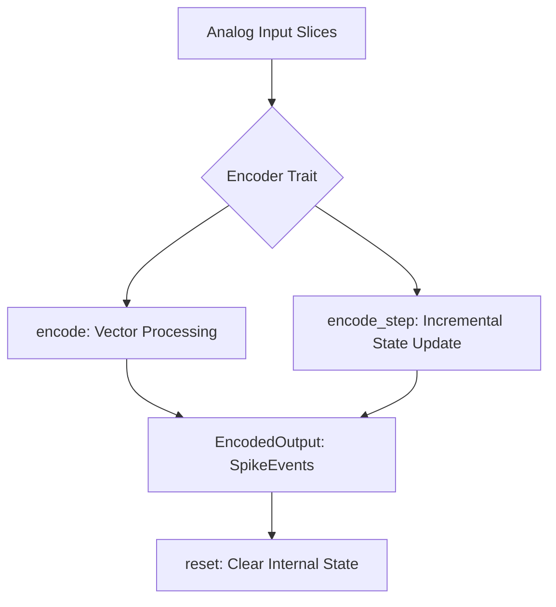
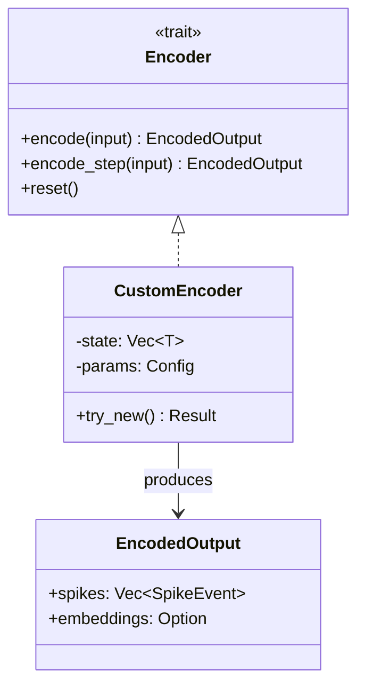

<details>
<summary>Relevant source files</summary>

The following files were used as context for generating this wiki page:

- [src/lib.rs](src/lib.rs)
- [src/encoder.rs](src/encoder.rs)
- [src/encoders/rate.rs](src/encoders/rate.rs)
- [src/encoders/predictive.rs](src/encoders/predictive.rs)
- [src/encoders/delta.rs](src/encoders/delta.rs)
- [src/encoders/temporal.rs](src/encoders/temporal.rs)
- [src/encoders/population.rs](src/encoders/population.rs)
</details>

# Implementing Custom Encoders

Implementing custom encoders in the `axon-encoder` library allows developers to extend the system's ability to translate continuous analog signals into discrete spike events. The library is built around a flexible trait-based architecture, ensuring that new encoding strategies—whether deterministic, stochastic, or stateful—can be integrated seamlessly into the existing neuromorphic pipeline.

The primary purpose of a custom encoder is to define the mathematical or logical mapping between real-world sensor values and `SpikeEvent` structures. By adhering to the core traits, custom encoders gain compatibility with batch processing, streaming modes, and neuromodulator-driven gain adjustments.
Sources: [README.md:12-25](README.md#L12-L25), [src/lib.rs:104-121](src/lib.rs#L104-L121)

## Core Abstractions

To implement a custom encoder, two primary traits must be considered: `Encoder` and `ModulatedEncoder`. These define how data flows through the encoder and how it reacts to external stimuli like neuromodulators.

### The Encoder Trait
The `Encoder` trait is the fundamental interface for all signal-to-spike translation. It supports two modes of operation:
*  **Batch Mode (`encode`)**: Processes an entire slice of values at once.
*  **Streaming Mode (`encode_step`)**: Processes values incrementally. For stateful encoders, this is where internal state (like membrane potentials or history buffers) is updated.



*The diagram above illustrates the high-level data flow through the standard Encoder trait.*
Sources: [src/lib.rs:136-168](src/lib.rs#L136-L168)

### The ModulatedEncoder Trait
For encoders that require dynamic scaling based on biological modulators (e.g., dopamine, cortisol), the `ModulatedEncoder` trait provides mechanisms to apply `EncodingGains`. This is typically used to scale firing rates, thresholds, or sensitivities.
Sources: [src/lib.rs:36-53](src/lib.rs#L36-L53)

## Data Structures and Types

Custom implementations rely on standardized types to ensure interoperability with the rest of the library.

| Type | Description | File Reference |
| :--- | :--- | :--- |
| `SpikeEvent` | Contains `channel` (u16), `timestamp` (u64), and `polarity` (bool). | `src/types.rs` |
| `EncodedOutput` | A collection of `SpikeEvent` objects, optional embeddings, and metadata. | `src/types.rs` |
| `EncoderError` | Enum for validation failures (e.g., `InvalidRange`, `NonNegativeFinite`). | `src/error.rs` |
| `EncoderState` | Specifically used for tracking `membrane_potentials` in integration-based encoders. | `src/encoder.rs:31-41` |

## Architecture for Custom Implementation

When designing a new encoder, the following architectural components are typically required:

### 1. Configuration and Construction
Encoders should provide a `try_new` constructor to validate parameters at runtime. Standard validations include checking for finite, non-negative values and ensuring channel counts do not exceed `u16::MAX`.
Sources: [src/encoders/rate.rs:90-112](src/encoders/rate.rs#L90-L112), [src/encoders/predictive.rs:137-152](src/encoders/predictive.rs#L137-L152)

### 2. State Management
Stateful encoders (like `PredictiveEncoder` or `TemporalEncoder`) must maintain internal buffers. For example, `TemporalEncoder` uses a `Vec<VecDeque<f32>>` to track per-channel history.
Sources: [src/encoders/temporal.rs:40-44](src/encoders/temporal.rs#L40-L44), [src/encoders/predictive.rs:92-97](src/encoders/predictive.rs#L92-L97)



*The class relationship between the core trait and a potential custom implementation.*
Sources: [src/lib.rs:136-168](src/lib.rs#L136-L168), [src/encoder.rs:44-53](src/encoder.rs#L44-L53)

## Implementation Patterns

### Pattern: Integration-Reset (Soft Reset)
Used in rate or population encoders where inputs are accumulated into a potential until a threshold is reached.
*  **Logic**: `potential += input; if potential >= threshold { fire_spike(); potential -= threshold; }`
*  **Benefit**: "Soft reset" preserves the remainder of the potential for the next step, preventing information loss.
Sources: [src/encoder.rs:91-105](src/encoder.rs#L91-L105), [src/encoders/rate.rs:247-251](src/encoders/rate.rs#L247-L251)

### Pattern: Derivative/Delta Thresholding
Used for event-driven encoding where spikes only fire upon significant change.
*  **Logic**: `delta = current - last; if delta.abs() > threshold { fire_spike(); last = current; }`
Sources: [src/encoders/delta.rs:55-75](src/encoders/delta.rs#L55-L75), [src/encoders/derivative.rs:69-89](src/encoders/derivative.rs#L69-L89)

### Pattern: Predictive Causal Windowing
Used for anomaly detection or predictive coding.
*  **Logic**: Maintains a history window (e.g., last 5 samples) to predict the next value. Spikes represent the prediction error.
Sources: [src/encoders/predictive.rs:154-188](src/encoders/predictive.rs#L154-L188)

## Example: Stateless Custom Logic
A simple custom encoder can be implemented by defining a struct and implementing the `Encoder` trait.

```rust
impl Encoder for MyCustomEncoder {
    fn encode(&mut self, input: &[f32]) -> EncodedOutput {
        let mut output = EncodedOutput::new();
        for (i, &val) in input.iter().enumerate() {
            if val > self.threshold {
                output.spikes.push(SpikeEvent {
                    channel: i as u16,
                    timestamp: 0,
                    polarity: true,
                });
            }
        }
        output
    }
    fn reset(&mut self) {}
}
```

Sources: [src/lib.rs:175-195](src/lib.rs#L175-L195), [src/encoders/delta.rs:109-125](src/encoders/delta.rs#L109-L125)

## Conclusion
Implementing custom encoders in `axon-encoder` involves leveraging the `Encoder` trait to define specific signal-to-spike logic. By using provided types like `SpikeEvent` and adhering to construction validation patterns found in existing modules like `RateEncoder` or `DeltaEncoder`, developers can create robust, stateful, and neuromodulator-aware encoding pipelines suited for diverse spiking neural network applications.
