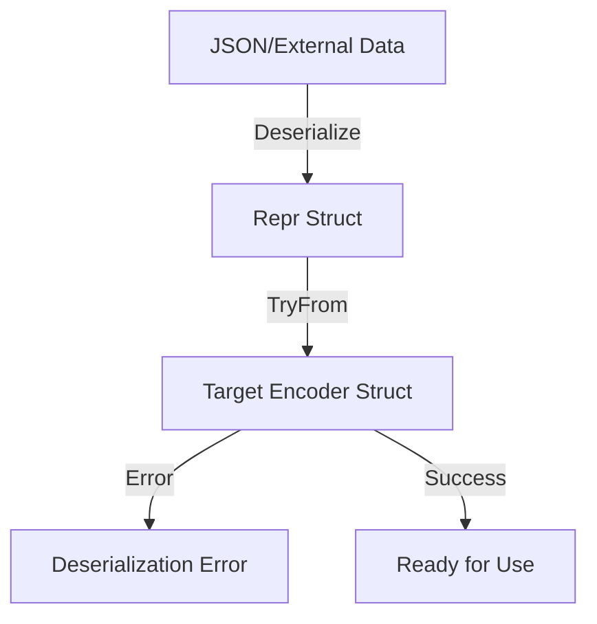
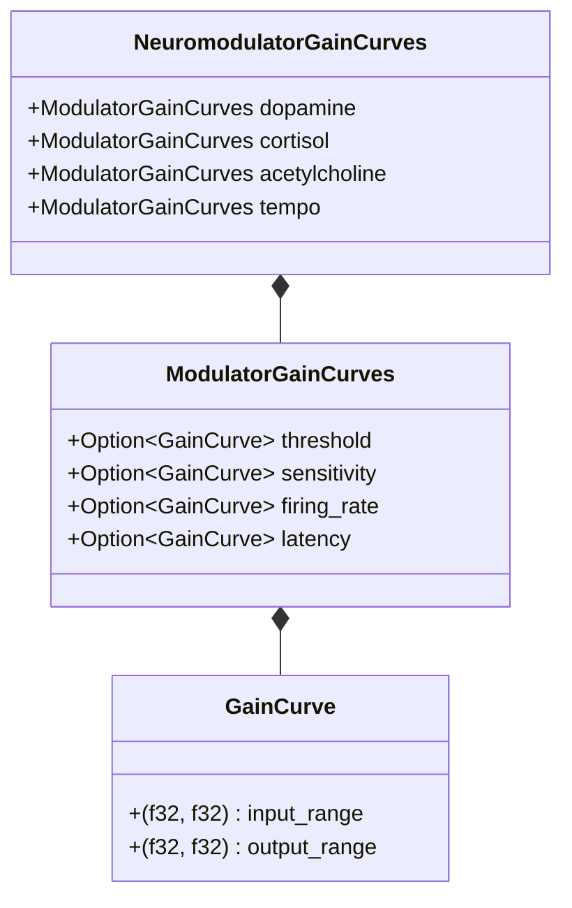

Relevant source files

The following files were used as context for generating this wiki page:

- [tests/serde\_tests.rs](tests/serde_tests.rs)
- [Cargo.toml](Cargo.toml)
- [src/encoder.rs](src/encoder.rs)
- [src/encoders/rate.rs](src/encoders/rate.rs)
- [src/encoders/predictive.rs](src/encoders/predictive.rs)
- [src/encoders/derivative.rs](src/encoders/derivative.rs)
- [src/encoders/phase.rs](src/encoders/phase.rs)
- [src/encoders/temporal.rs](src/encoders/temporal.rs)
- [src/modulators.rs](src/modulators.rs)
- [src/types.rs](src/types.rs)

# Serialization & Deserialization (Serde)

Serialization and Deserialization in the `axon-encoder` project provide the ability to persist and restore the state of various sensory encoders and neuromodulator configurations. This functionality is primarily implemented using the `serde` framework, allowing for the conversion of complex Rust structures into formats like JSON for storage or network transmission.

The system is designed with a strong emphasis on validation during deserialization. Encoders often require specific invariants—such as positive thresholds, finite values, and matched channel counts—to function correctly. The implementation utilizes custom `Deserialize` implementations and "Repr" (representation) structs to ensure that any data loaded from an external source meets these strict technical requirements.

Sources: [Cargo.toml:13-23](Cargo.toml#L13-L23), [tests/serde\_tests.rs:1-5](tests/serde\_tests.rs#L1-L5)

## Core Data Structures

The core types responsible for communicating spikes and encoder configurations are fully serializable. This includes the fundamental `SpikeEvent` and the `EncodedOutput` container.

### Primary IO Types
The following table describes the fields of the primary IO types subjected to serialization:

| Structure | Field | Type | Description |
| :--- | :--- | :--- | :--- |
| `SpikeEvent` | `channel` | `u16` | The ID of the spiking channel. |
| `SpikeEvent` | `timestamp` | `u64` | The time or step when the spike occurred. |
| `SpikeEvent` | `polarity` | `bool` | The excitatory (true) or inhibitory (false) nature. |
| `EncodedOutput` | `spikes` | `Vec<SpikeEvent>` | Collection of generated spike events. |
| `EncodedOutput` | `embeddings` | `Option<Vec<f32>>` | Optional raw values or embeddings. |
| `EncoderConfig` | `input_channels`| `usize` | Number of input channels. |

Sources: [src/types.rs:5-46](src/types.rs#L5-L46), [tests/serde\_tests.rs:9-38](tests/serde\_tests.rs#L9-L38)

## Serialization Architecture

The project employs several strategies to ensure data integrity during the serialization cycle.

### Validation via TryFrom and Repr Structs
For several encoders, the project uses a pattern involving a private "Repr" struct and the `TryFrom` trait. This allows the `serde` derive macro to first deserialize into a raw format and then attempt a conversion that includes validation logic.

This flow ensures that values like `v_th` (threshold voltage) in the `EmbeddingEncoderConfig` are strictly positive before the struct is instantiated.

Sources: [src/encoder.rs:4-21](src/encoder.rs#L4-L21), [src/encoders/derivative.rs:12-35](src/encoders/derivative.rs#L12-L35)

### Manual Deserialization Logic
More complex encoders, such as `PredictiveEncoder` and `RateEncoder`, implement the `Deserialize` trait manually to perform multi-field validation, such as checking that history buffers do not exceed the defined `history_depth`.

Sources: [src/encoders/predictive.rs:244-285](src/encoders/predictive.rs#L244-L285), [src/encoders/rate.rs:228-262](src/encoders/rate.rs#L228-L262)

## Encoder-Specific Implementation

Each encoder has specific serialization requirements based on its internal state.

### Rate Encoder Backward Compatibility
The `RateEncoder` handles backward compatibility by renaming internal fields during serialization. The `phases` field is serialized as `accumulators`. During deserialization, it can also process legacy formats where whole spikes and fractional phases were combined into a single float.

Sources: [src/encoders/rate.rs:55-75](src/encoders/rate.rs#L55-L75), [src/encoders/rate.rs:252-261](src/encoders/rate.rs#L252-L261)

### Predictive and Temporal History
`PredictiveEncoder` and `TemporalEncoder` serialize their history as a `Vec<VecDeque<f32>>`. Deserialization logic ensures that:
1. The history length matches the number of thresholds.
2. The history per channel does not exceed the `history_depth`.
3. All `deviation_thresholds` or `change_thresholds` are finite and non-negative.

Sources: [src/encoders/predictive.rs:244-298](src/encoders/predictive.rs#L244-L298), [src/encoders/temporal.rs:163-207](src/encoders/temporal.rs#L163-L207)

## Neuromodulator and Gain Curves

The neuromodulation system uses serialization to define "Gain Curves" that adjust encoder behavior at runtime.

### GainCurve Schema
`GainCurve` uses a helper during deserialization to validate that the `input_range` is finite and that the minimum is strictly less than the maximum.

| Field | Type | Constraint |
| :--- | :--- | :--- |
| `input_range` | `(f32, f32)` | `min < max`, both finite. |
| `output_range` | `(f32, f32)` | Both finite. |

Sources: [src/modulators.rs:55-103](src/modulators.rs#L55-L103), [tests/serde\_tests.rs:88-100](tests/serde\_tests.rs#L88-L100)

The diagram shows the nested relationship of neuromodulator configurations which are fully serializable to JSON.

Sources: [src/modulators.rs:136-220](src/modulators.rs#L136-L220), [tests/serde\_tests.rs:102-138](tests/serde\_tests.rs#L102-L138)

## Validation Failures

The following conditions are explicitly tested and rejected during deserialization to prevent invalid encoder states:

*  **PhaseEncoder**: Rejects `cycle_steps` equal to 0. Sources: [src/encoders/phase.rs:135-155](src/encoders/phase.rs#L135-L155), [tests/serde\_tests.rs:189-194](tests/serde\_tests.rs#L189-L194)
*  **PredictiveEncoder**: Rejects `history_depth` less than 5. Sources: [src/encoders/predictive.rs:271](src/encoders/predictive.rs#L271), [tests/serde\_tests.rs:154-159](tests/serde\_tests.rs#L154-L159)
*  **DerivativeEncoder**: Rejects mismatched lengths between `last_values` and `thresholds`. Sources: [src/encoders/derivative.rs:21-25](src/encoders/derivative.rs#L21-L25), [tests/serde\_tests.rs:167-172](tests/serde\_tests.rs#L167-L172)
*  **RateEncoder**: Rejects non-finite or negative `accumulators`. Sources: [src/encoders/rate.rs:243-247](src/encoders/rate.rs#L243-L247), [tests/serde\_tests.rs:200-203](tests/serde\_tests.rs#L200-L203)
*  **Channel Counts**: All encoders reject states exceeding `u16::MAX + 1` channels (65536) during deserialization because `SpikeEvent` channel IDs are restricted to `u16`. Sources: [src/encoder.rs:51-53](src/encoder.rs#L51-L53), [src/encoders/predictive.rs:265-269](src/encoders/predictive.rs#L265-L269)

## Summary

The Serialization and Deserialization module in `axon-encoder` ensures that encoder states can be reliably saved and loaded. By integrating strict validation logic directly into the `serde` pipeline via `TryFrom` and custom `Deserialize` implementations, the project guarantees that restored encoders maintain their mathematical invariants and operational stability.
