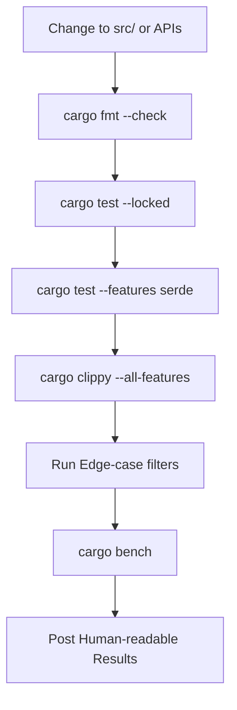
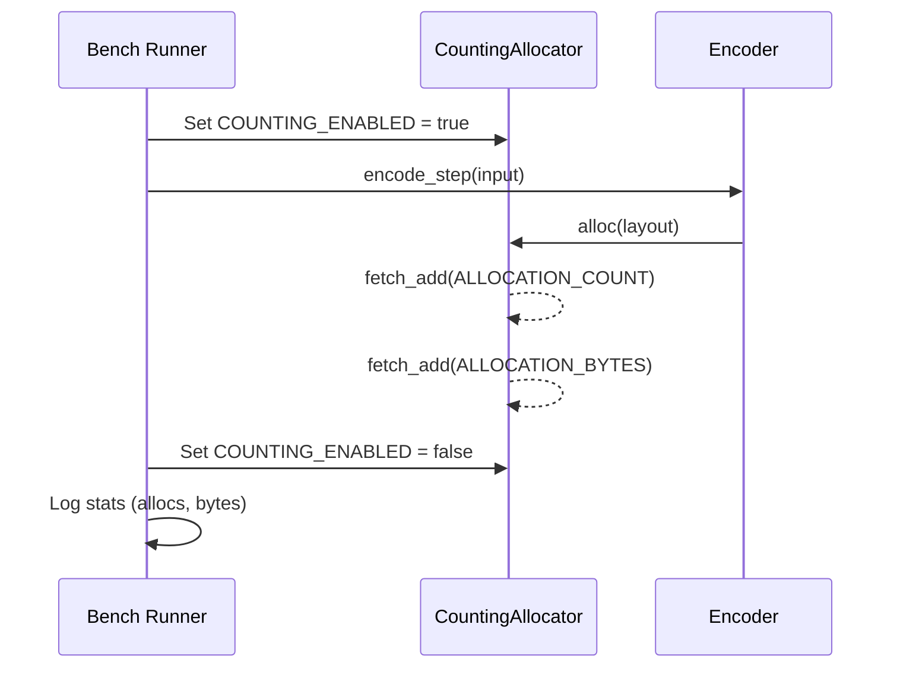

Relevant source files

The following files were used as context for generating this wiki page:

- [REVIEW.md](REVIEW.md)
- [qodana.yaml](qodana.yaml)
- [README.md](README.md)
- [src/error.rs](src/error.rs)
- [benches/allocations.rs](benches/allocations.rs)
- [tests/serde_tests.rs](tests/serde_tests.rs)

# Quality Gates and Review Process

The Quality Gates and Review Process in the `axon-encoder` project represents a multi-layered verification strategy designed to ensure the technical integrity, performance, and security of sensory encoding algorithms. It differentiates between automated CI/CD checks (GitHub Actions, Qodana) and a "human quality bar" that must be cleared before a Pull Request (PR) is considered ready for merge.

This process is particularly critical for security-oriented PRs (e.g., PR #50) to prevent "green CI" states from masking the deletion of essential product surfaces or public APIs.
Sources: [REVIEW.md:1-10](REVIEW.md#L1-L10), [README.md:3-8](README.md#L3-L8)

## Local Review Quality Gate

The local review gate consists of a mandatory suite of commands that developers must run after any changes to `src/`, `Cargo.toml`, public APIs, or Random Number Generation (RNG) code. These checks ensure that formatting is clean, logic remains sound under various feature flags, and RNG outputs remain consistent.

### Core Test Matrix
The core matrix verifies the library across different configurations and specific edge-case filters to catch regressions in stochastic and population-based encoders.

| Command | Purpose |
|---------|---------|
| `cargo fmt --check` | Validates code style compliance. |
| `cargo test --locked` | Runs standard tests with dependency version locking. |
| `cargo test --features serde --locked` | Verifies serialization/deserialization logic. |
| `cargo clippy --all-features -- -D warnings` | Enforces linting and prevents compilation with warnings. |
| `cargo test ... rng::tests` | Ensures RNG stability. |

Sources: [REVIEW.md:16-36](REVIEW.md#L16-L36), [tests/serde_tests.rs:1-5](tests/serde_tests.rs#L1-L5)

### PR Validation Workflow
The following diagram illustrates the sequence of operations required for a local sign-off on a Pull Request.

This flow ensures that no stage is skipped before claiming a PR is ready.
Sources: [REVIEW.md:12-60](REVIEW.md#L12-L60)

## Automated Quality Gates (Qodana & CI)

The project utilizes JetBrains Qodana for static analysis and code quality monitoring. This automated gate is configured to fail the CI/CD pipeline if specific problem thresholds are exceeded or if test coverage drops below defined levels.

### Failure Conditions
Qodana is configured with the following severity and coverage thresholds:

*  **Severity Thresholds**: The pipeline fails if more than 15 total problems or 5 critical problems are detected.
*  **Coverage Thresholds**: Minimum 70% coverage is required for newly added code ("fresh") and 50% for the total project.

Sources: [qodana.yaml:45-53](qodana.yaml#L45-L53)

### Integration Tests
Integration testing, specifically for `serde` compatibility, ensures that complex structures like `NeuromodulatorGainCurves` and `RateEncoder` state can be persisted and restored without data loss or validation failure.
Sources: [tests/serde_tests.rs:56-118](tests/serde_tests.rs#L56-L118)

## Performance and Allocation Monitoring

Performance quality is maintained through two distinct benchmarking paths: Criterion-based execution for speed and a custom allocation-tracking harness.

### Allocation Smoke Tests
The `allocations.rs` benchmark uses a `CountingAllocator` to track net growth in memory during encoder operations. This prevents memory leaks and inefficient growth in core loops.

The diagram shows how the project measures memory overhead per operation.
Sources: [benches/allocations.rs:17-57](benches/allocations.rs#L17-L57), [REVIEW.md:43-46](REVIEW.md#L43-L46)

## Regression Guards and Security

Specific checks are enforced to prevent the silent deletion of the project's "product surface." This is handled through grep-based (ripgrep) validation of the codebase structure.

### Mandatory API Checks
Before merging, the following conditions must be met:
1.  **File Integrity**: `src/modulators.rs` must not collapse into a stub (verified by line count > 400).
2.  **API Presence**: Key structs like `GainCurve`, `NeuromodulatorGainCurves`, and `PhaseEncoder` must remain exported in their respective modules.
3.  **Method Preservation**: The `encode_with_modulators` method must exist on all main encoders.

Sources: [REVIEW.md:120-137](REVIEW.md#L120-L137), [REVIEW.md:166-173](REVIEW.md#L166-L173)

## PR Submission and Reporting

Reviewers and authors are required to post human-readable results rather than raw terminal output. This improves review efficiency by leading with a verdict and providing summary tables.

### Reporting Template Requirements
*  **Branch Tip SHA**: Must identify the exact commit verified.
*  **Verdict**: One-line pass/fail status.
*  **Summary Table**: Categorized results for formatting, tests, clippy, and RNG.
*  **Noise Context**: Statement of host noise (e.g., local laptop vs dedicated server) for benchmarks.

Sources: [REVIEW.md:62-95](REVIEW.md#L62-L95)

### Implementation of Runtime Validation
Quality is also enforced at the code level through fallible constructors (`try_new`). This prevents invalid configurations (e.g., non-finite rates, empty windows, or invalid ranges) from entering the system.
Sources: [src/error.rs:5-35](src/error.rs#L5-L35), [src/error.rs:88-100](src/error.rs#L88-L100)

## Conclusion
The quality gates of the `axon-encoder` repository create a layered defense against regressions. By combining runtime validation via `EncoderError`, automated static analysis through Qodana, and strict manual regression guards for public APIs, the project maintains high standards for SNN encoding reliability.
