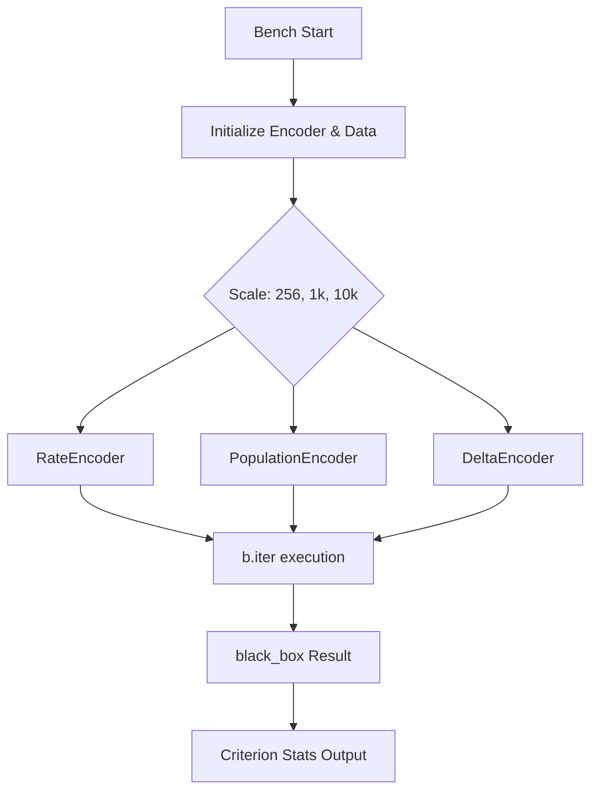
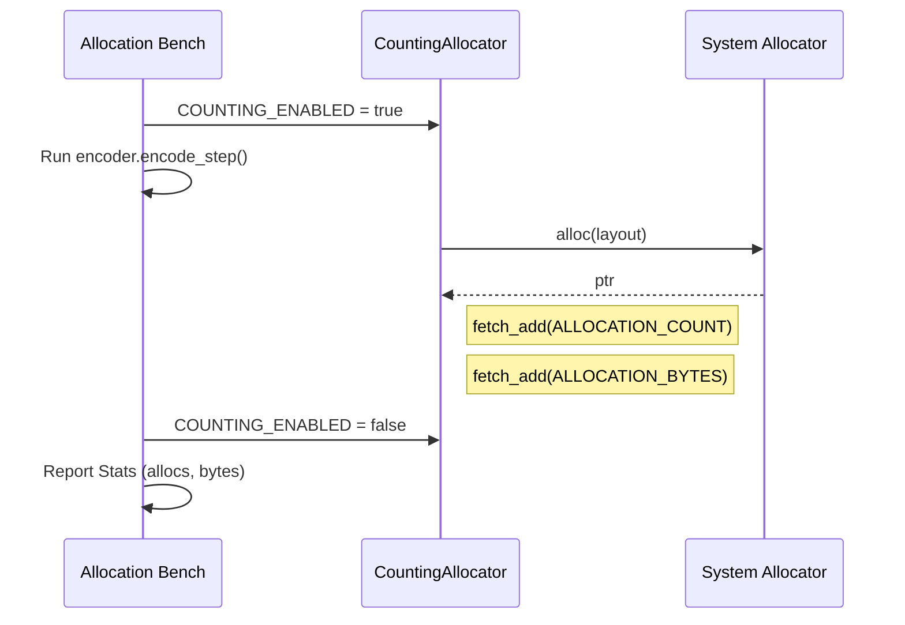
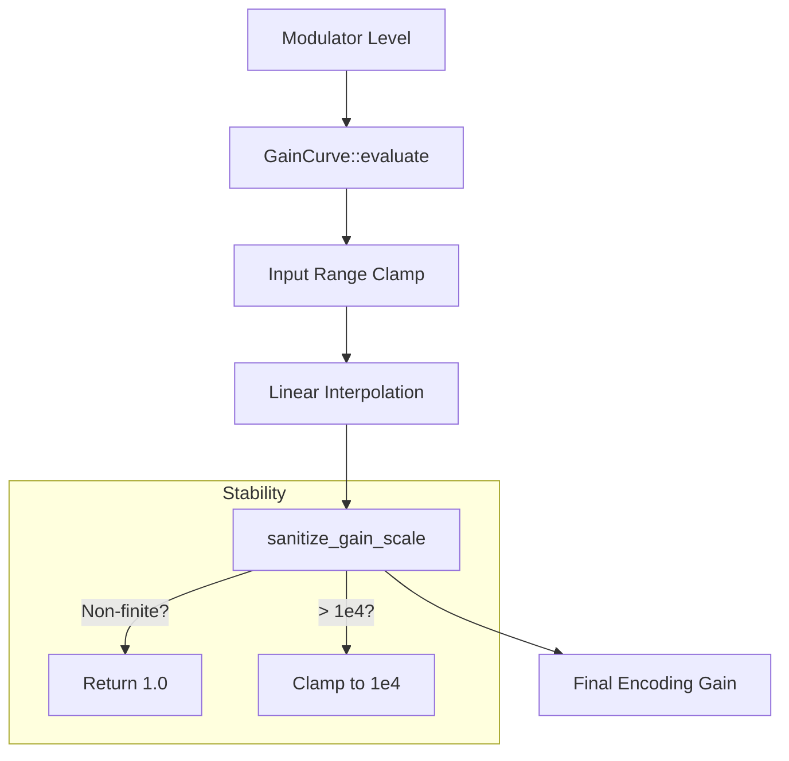

Relevant source files

The following files were used as context for generating this wiki page:

- [benches/allocations.rs](benches/allocations.rs)
- [benches/encoders.rs](benches/encoders.rs)
- [REVIEW.md](REVIEW.md)
- [src/encoders/rate.rs](src/encoders/rate.rs)
- [src/modulators.rs](src/modulators.rs)
- [README.md](README.md)

# Benchmarking and Performance

Benchmarking and performance analysis within the `axon-encoder` project focus on ensuring the efficiency and scalability of sensory encoding algorithms. The system utilizes automated benchmarks to track execution time (via Criterion) and memory overhead (via a custom allocation tracker). These metrics act as a quality bar for pull requests, preventing performance regressions in core encoding logic.

The performance suite covers various encoding strategies, including `RateEncoder`, `DeltaEncoder`, `PopulationEncoder`, and `PoissonEncoder`. It evaluates these encoders across different scales (e.g., channel counts of 256, 1024, and 10,000) to ensure that time complexity and memory usage remain within acceptable limits for real-time neuromorphic applications.

Sources: [REVIEW.md:5-15](REVIEW.md#L5-L15), [benches/encoders.rs:9-10](benches/encoders.rs#L9-L10), [README.md:129-133](README.md#L129-L133)

## Benchmarking Frameworks

The project employs two distinct benchmarking approaches to capture a complete profile of the encoder performance:

1.  **Criterion Benchmarking**: Used for measuring execution time and identifying micro-architectural regressions. It provides statistical analysis, including "change %" compared to local baselines.
2.  **Allocation Tracking**: A custom harness using a `GlobalAlloc` implementation to monitor the number of heap allocations and total bytes used during specific encoder operations.

### Measurement Categories

| Category | Tool / Command | Primary Metric | Purpose |
| :--- | :--- | :--- | :--- |
| **Execution Speed** | `cargo bench --bench encoders` | Nanoseconds / Change % | Measure throughput and latency of `encode` and `encode_step` methods. |
| **Memory Usage** | `cargo bench --bench allocations` | Allocations / Bytes | Ensure core encoding loops are zero-allocation or minimize heap growth. |
| **Stability** | `REVIEW.md` quality gate | Pass/Fail | Mandatory checks for formatting, clippy warnings, and edge-case tests. |

Sources: [REVIEW.md:39-50](REVIEW.md#L39-L50), [benches/allocations.rs:16-56](benches/allocations.rs#L16-L56), [benches/encoders.rs:24-34](benches/encoders.rs#L24-L34)

## Execution Time Performance

Benchmarks in `benches/encoders.rs` measure the latency of encoding operations across different scales. The test suite specifically differentiates between `encode` (batch processing) and `encode_step` (streaming/incremental processing).

The diagram shows the standard flow for benchmarking individual encoders using Criterion's `iter` and `black_box` to prevent compiler optimizations from skewing results.

Sources: [benches/encoders.rs:9-62](benches/encoders.rs#L9-L62)

### Performance Considerations by Encoder Type

*  **RateEncoder**: Performance is sensitive to the number of input channels and the `dt_seconds` parameter. Streaming mode (`encode_step`) accumulates phase until a threshold is reached, while batch mode is stochastic.
*  **PopulationEncoder**: Benchmarked based on the number of neurons per input. It uses Gaussian-like tuning curves which involve exponential calculations.
*  **DeltaEncoder**: Efficiently detects changes by comparing current inputs to a stored baseline, making it highly dependent on input sparsity.

Sources: [src/encoders/rate.rs:15-38](src/encoders/rate.rs#L15-L38), [benches/encoders.rs:56-85](benches/encoders.rs#L56-L85)

## Memory and Allocation Analysis

The library aims for high-performance core encoding loops with minimal memory allocation. To verify this, `benches/allocations.rs` uses a `CountingAllocator` to hook into the global allocator and count active memory operations.

The sequence diagram illustrates how the `CountingAllocator` wraps the system allocator to capture net growth metrics during a measured operation.

Sources: [benches/allocations.rs:22-56](benches/allocations.rs#L22-L56), [benches/allocations.rs:95-108](benches/allocations.rs#L95-L108)

### Allocation Measurement Logic
The `CountingAllocator` tracks `alloc`, `alloc_zeroed`, and `realloc`. Notably, `dealloc` is not tracked to focus specifically on the "net growth" and overhead generated by the encoding operation itself rather than the cleanup phase.

Sources: [benches/allocations.rs:51-56](benches/allocations.rs#L51-L56)

## Optimization and Numerical Stability

Performance is also tied to numerical stability, especially when neuromodulators are applied. The system uses `sanitize_gain_scale` to clamp gain factors between `0.0` and `1e4`, preventing non-finite values from poisoning the performance of the spiking logic.

### Gain Scale Limits
| Constant | Value | Description |
| :--- | :--- | :--- |
| `MIN_GAIN_SCALE` | `0.0` | Allows true zero gain for full silence. |
| `MAX_GAIN_SCALE` | `1e4` | Prevents numerical overflow in gain calculations. |

Sources: [src/modulators.rs:6-14](src/modulators.rs#L6-L14), [src/modulators.rs:104-106](src/modulators.rs#L104-L106)

### Numerical Flow for Gains

This diagram depicts the logic used to transform modulator levels into stable gains used during the encoding process.

Sources: [src/modulators.rs:60-78](src/modulators.rs#L60-L78), [src/modulators.rs:16-22](src/modulators.rs#L16-L22)

## Quality Gates and Regression Monitoring

The project defines a "human quality bar" in `REVIEW.md` that must be met before merging code that touches encoders or RNG logic. This includes:

*  **Criterion Baseline Comparison**: Developers are encouraged to use `--save-baseline` to compare PR performance against the `main` branch.
*  **Edge-case Filtering**: Specific benchmarks for empty inputs (e.g., `test_population_encoder_empty_input`) and non-finite rates.
*  **Smoke Tests**: Fast benchmark runs for allocations (`cargo bench --bench allocations`) to ensure no unexpected heap growth.

Sources: [REVIEW.md:40-62](REVIEW.md#L40-L62), [REVIEW.md:121-135](REVIEW.md#L121-L135)

## Conclusion

Benchmarking in `axon-encoder` provides a dual-layered verification of speed and memory efficiency. By combining Criterion's statistical timing with a custom allocation-tracking harness, the project ensures that sensory encoding remains performant across varying scales of input data while maintaining numerical stability through strict gain sanitization.

Sources: [REVIEW.md:44-50](REVIEW.md#L44-L50), [benches/allocations.rs:175-184](benches/allocations.rs#L175-L184)
