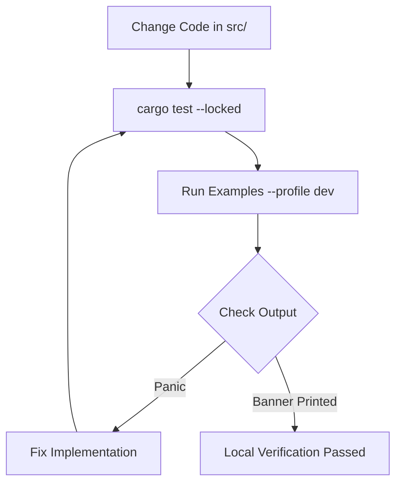
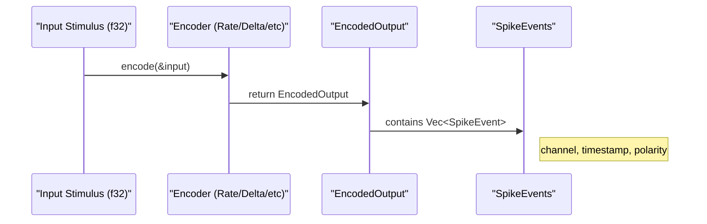

<details>
<summary>Relevant source files</summary>

The following files were used as context for generating this wiki page:

- [examples/delta\_encoding.rs](examples/delta_encoding.rs)
- [examples/latency\_encoding.rs](examples/latency_encoding.rs)
- [examples/temporal\_encoding.rs](examples/temporal_encoding.rs)
- [examples/rate\_encoding.rs](examples/rate_encoding.rs)
- [README.md](README.md)
- [REVIEW.md](REVIEW.md)
- [Cargo.toml](Cargo.toml)

</details>

# Working with Examples

## Introduction
The `axon-encoder` repository includes a dedicated `/examples` directory designed to demonstrate the practical application of various sensory encoding algorithms. These examples serve as behavioral "smoke tests" and educational guides for developers, showing how to convert continuous data into event-based spike signals suitable for Spiking Neural Networks (SNNs). Sources: [README.md:144-147](README.md#L144-L147), [REVIEW.md:92-100](REVIEW.md#L92-L100)

Each example focuses on a specific encoding strategy, such as rate-based, delta-based, or temporal encoding, providing a blueprint for initializing encoders, simulating input stimulus, and processing the resulting spike events. Sources: [README.md:32-41](README.md#L32-L41), [examples/delta\_encoding.rs:16-20](examples/delta\_encoding.rs#L16-L20)

## Execution and Verification
Examples can be executed using standard `cargo run` commands. They are used as a human quality bar to ensure that public APIs and core logic function correctly before merging code. Sources: [REVIEW.md:4-7](REVIEW.md#L4-L7), [README.md:149-159](README.md#L149-L159)

### Execution Commands
| Task | Command |
| :--- | :--- |
| Run Delta Encoding | `cargo run --example delta_encoding` |
| Run Rate Encoding | `cargo run --example rate_encoding` |
| Run Temporal Encoding | `cargo run --example temporal_encoding` |
| Run ndarray Example | `cargo run --example ndarray_encoding --features ndarray` |

Sources: [README.md:154-159](README.md#L154-L159), [REVIEW.md:104-107](REVIEW.md#L104-L107)

### Verification Flow
The following diagram illustrates the workflow for using examples as part of the local review process.



Developers verify that each example prints its encoder banner without panicking. Sources: [REVIEW.md:92-101](REVIEW.md#L92-L101), [REVIEW.md:111-111](REVIEW.md#L111)

## Key Implementation Patterns
Examples typically follow a structured pattern: loading configuration, initializing a specific encoder type, creating stimulus, and iterating through encoding steps.

### Encoder Initialization
Most examples utilize `try_new` for typed validation error handling, though legacy `new` methods are occasionally shown for simple demonstrations. Sources: [README.md:183-189](README.md#L183-L189), [examples/rate\_encoding.rs:15-16](examples/rate\_encoding.rs#L15-L16)

```rust
// Example from rate_encoding.rs
let mut encoder = RateEncoder::try_new(5.0, 100.0, (0.0, 1.0), 0.010)
    .expect("valid RateEncoder");
```

Sources: [examples/rate\_encoding.rs:15-16](examples/rate\_encoding.rs#L15-L16)

### Data Flow Pattern
The data flow within the examples involves converting a `Vec<f32>` or slice of analog readings into an `EncodedOutput` struct containing `SpikeEvent` objects. Sources: [README.md:106-118](README.md#L106-L118), [examples/delta\_encoding.rs:32-33](examples/delta\_encoding.rs#L32-L33)



Sources: [README.md:106-118](README.md#L106-L118), [examples/delta\_encoding.rs:38-46](examples/delta\_encoding.rs#L38-L46)

## Example Categories

### Event-Based Change Detection
The `delta_encoding` example demonstrates firing spikes only when the difference between the current input and the last encoded value exceeds a threshold. Sources: [examples/delta\_encoding.rs:4-7](examples/delta\_encoding.rs#L4-L7)

*  **Logic:** A spike triggers if `|current - last| > threshold`.
*  **Polarity:** `true` indicates an increase, `false` indicates a decrease.
Sources: [examples/delta\_encoding.rs:20-29](examples/delta\_encoding.rs#L20-L29)

### Firing Rate Mapping
The `rate_encoding` example maps input intensity to a firing frequency. Higher values result in more frequent spikes within the defined Hertz (Hz) range. Sources: [README.md:34-35](README.md#L34-L35), [examples/rate\_encoding.rs:21-25](examples/rate\_encoding.rs#L21-L25)

### Multi-Channel Processing
Examples often demonstrate multi-channel capabilities by processing vectors of inputs. For instance, the delta example tracks state independently for two channels. Sources: [examples/delta\_encoding.rs:20-29](examples/delta\_encoding.rs#L20-L29), [examples/rate\_encoding.rs:18-19](examples/rate\_encoding.rs#L18-L19)

## Project Requirements
The `Cargo.toml` file defines specific requirements for running certain examples, particularly those involving `ndarray`. Sources: [Cargo.toml:17-21](Cargo.toml#L17-L21)

| Example Name | Required Features |
| :--- | :--- |
| `ndarray_encoding` | `ndarray` |
| Standard Encoders | (None) |

Sources: [Cargo.toml:17-21](Cargo.toml#L17-L21)

## Conclusion
Working with examples in `axon-encoder` provides an immediate feedback loop for validating encoder behavior and configuration. By running these examples, developers can ensure that the mathematical models for rate, delta, and temporal encoding correctly translate analog signals into the spike trains required for neuromorphic systems. Sources: [README.md:144-147](README.md#L144-L147), [REVIEW.md:92-100](REVIEW.md#L92-L100)
