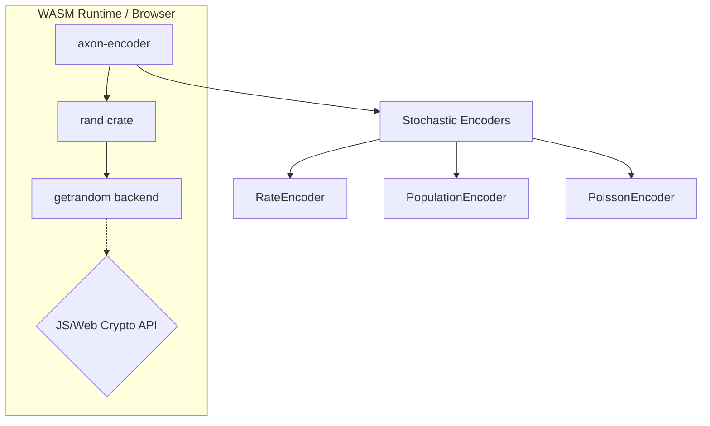
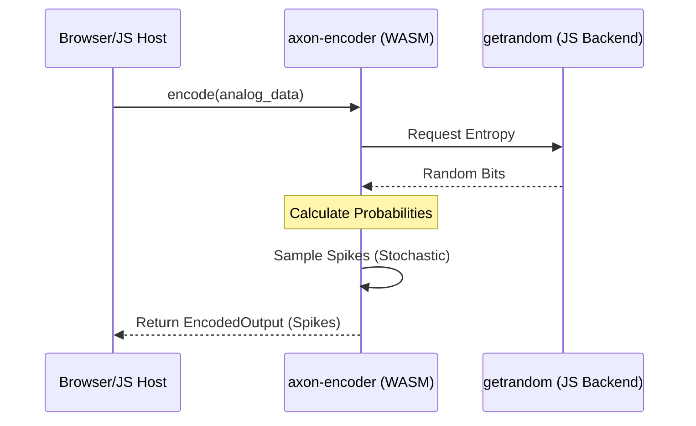

<details>
<summary>Relevant source files</summary>

The following files were used as context for generating this wiki page:

- [README.md](README.md)
- [Cargo.toml](Cargo.toml)
- [src/poisson.rs](src/poisson.rs)
- [src/encoders/rate.rs](src/encoders/rate.rs)
- [src/encoders/population.rs](src/encoders/population.rs)
</details>

# WebAssembly (WASM) Support

Axon Encoder provides support for the `wasm32-unknown-unknown` target, enabling sensory encoding for Spiking Neural Networks (SNNs) within WebAssembly environments such as web browsers or edge compute runtimes. The library's core logic remains consistent across platforms, but specific considerations are required for stochastic operations and dependency management.

Sources: [README.md:68-72](README.md#L68-L72)

## Architecture and Environment Requirements

When targeting WebAssembly, the project relies on the standard Rust toolchain and specific external crates to handle entropy and randomness. Because the library is designed to be lightweight with minimal dependencies, it is well-suited for integration into distributed or browser-based neuromorphic simulations.

### Random Number Generation (RNG)
Stochastic encoders—specifically those that utilize probabilistic spike sampling—depend on the `rand` crate and its underlying entropy sources. In a WebAssembly context, developers must ensure a valid backend is provided for the `getrandom` crate, which often involves enabling JS/browser-specific features in the build toolchain.

Sources: [README.md:68-72](README.md#L68-L72), [Cargo.toml:13](Cargo.toml#L13)



The diagram above illustrates how `axon-encoder` interacts with the WASM environment to secure the entropy required for stochastic encoding strategies.
Sources: [README.md:68-72](README.md#L68-L72), [src/encoders/rate.rs:136-138](src/encoders/rate.rs#L136-L138), [src/encoders/population.rs:114-116](src/encoders/population.rs#L114-L116)

## Stochastic Encoder Integration

Three primary encoders utilize stochasticity and are therefore affected by WASM RNG configurations. These encoders sample spikes by drawing unit floats in the range `[0, 1)` and comparing them against calculated firing probabilities.

| Encoder | Mechanism | WASM Impact |
| :--- | :--- | :--- |
| `RateEncoder` | Uses `1 - exp(-rate_hz * dt_seconds)` for per-step probability. | Requires OS/entropy-backed RNG via `rand`. |
| `PopulationEncoder` | Gaussian tuning curve determines firing chance. | Requires `axon_encoder::rng` to function. |
| `PoissonEncoder` | Generates spike trains with Poisson timing. | Operates stochastically using thread-local or seeded RNG. |

Sources: [README.md:57-61](0, 1)` and comparing them against calculated firing probabilities.

| Encoder | Mechanism | WASM Impact |
| :--- | :--- | :--- |
| `RateEncoder` | Uses `1 - exp(-rate_hz * dt_seconds)` for per-step probability. | Requires OS/entropy-backed RNG via `rand`. |
| `PopulationEncoder` | Gaussian tuning curve determines firing chance. | Requires `axon_encoder::rng` to function. |
| `PoissonEncoder` | Generates spike trains with Poisson timing. | Operates stochastically using thread-local or seeded RNG. |

Sources: [README.md:57-61), [src/encoders/rate.rs:13-15](src/encoders/rate.rs#L13-L15), [src/encoders/population.rs:15-20](src/encoders/population.rs#L15-L20), [src/poisson.rs:10-14](src/poisson.rs#L10-L14)

### Implementation Details in WASM
In the source code, these encoders call `rand::rng()` or `crate::rng::gen_unit_f32_with_rng`. In WASM environments, if the `getrandom` backend is not correctly configured, these calls may fail or panic depending on the runtime's handling of missing entropy sources.

```rust
// Example of stochastic sampling used in RateEncoder and PopulationEncoder
let mut rng = rand::rng();
// ... inside encoding loop
if crate::rng::gen_unit_f32_with_rng(&mut rng) < probability {
    output.spikes.push(SpikeEvent { /* ... */ });
}
```

Sources: [src/encoders/rate.rs:136-146](src/encoders/rate.rs#L136-L146), [src/encoders/population.rs:114-123](src/encoders/population.rs#L114-L123)

## Build Configuration for WASM

To ensure compatibility with WebAssembly, the `Cargo.toml` must be configured to support the necessary features of dependencies. While `axon-encoder` itself is lightweight, the `rand` dependency version `0.10.2` is used to provide the underlying infrastructure for random sampling.

### Feature Gates and Dependencies
| Dependency | Version | Role in WASM Support |
| :--- | :--- | :--- |
| `rand` | `0.10.2` | Core RNG provider; requires WASM-compatible backend. |
| `serde` | `1.0` | Optional; enables state serialization/deserialization for saving encoder states in WASM apps. |
| `ndarray` | `0.16` | Optional; provides efficient view helpers if the WASM environment uses `ndarray`. |

Sources: [Cargo.toml:11-20](Cargo.toml#L11-L20), [README.md:68-72](README.md#L68-L72)

## Data Flow for WebAssembly Integration

The data flow within a WASM application follows the standard `axon-encoder` pipeline: continuous analog data is passed from the host (e.g., JavaScript) into the WASM module, processed by an encoder, and returned as a discrete set of `SpikeEvent` objects.



The sequence diagram shows the interaction between the host environment and the encoder when performing stochastic operations.
Sources: [src/encoders/rate.rs:136-153](src/encoders/rate.rs#L136-L153), [src/poisson.rs:66-78](src/poisson.rs#L66-L78), [README.md:68-72](README.md#L68-L72)

## Summary of WASM Compatibility
`axon-encoder` supports WebAssembly by ensuring its core encoding algorithms are platform-agnostic. The primary requirement for successful WASM deployment is the configuration of a `getrandom` backend to support the stochastic nature of `RateEncoder`, `PopulationEncoder`, and `PoissonEncoder`. Deterministic encoders (such as `DeltaEncoder` or `DerivativeEncoder`) operate in WASM without additional environmental requirements beyond the standard Rust runtime.

Sources: [README.md:28-36](README.md#L28-L36), [README.md:68-72](README.md#L68-L72)
