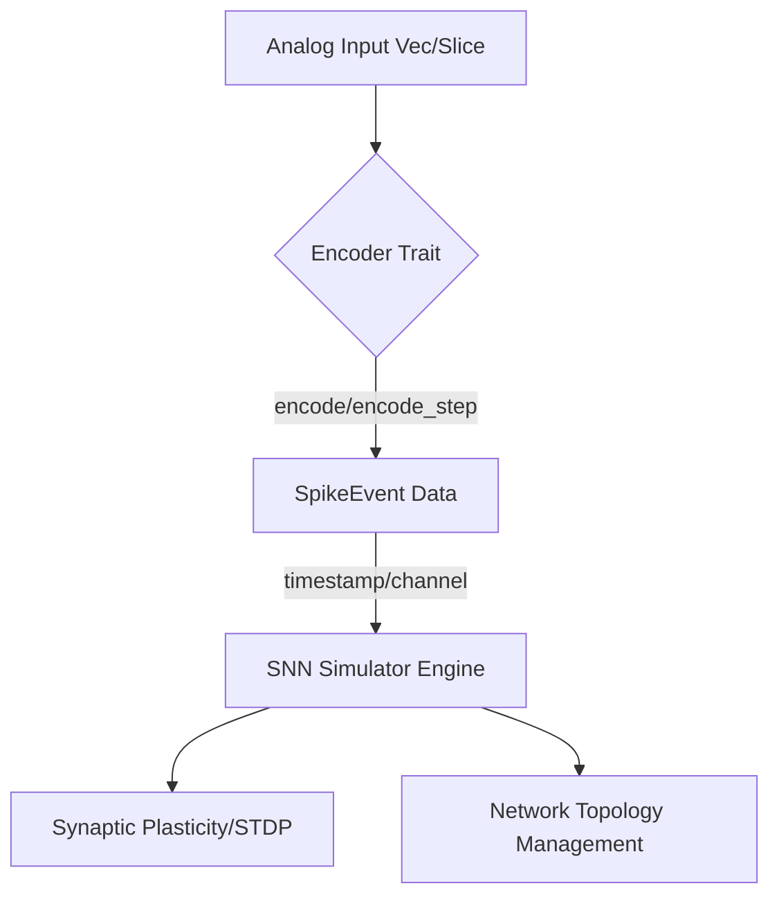
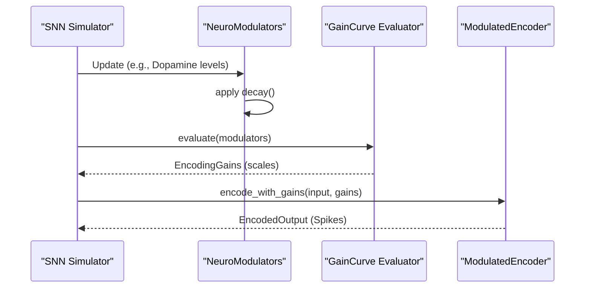

<details>
<summary>Relevant source files</summary>

The following files were used as context for generating this wiki page:

- [README.md](README.md)
- [src/lib.rs](src/lib.rs)
- [src/encoders/rate.rs](src/encoders/rate.rs)
- [src/encoders/phase.rs](src/encoders/phase.rs)
- [src/modulators.rs](src/modulators.rs)
- [src/poisson.rs](src/poisson.rs)

</details>

# Integration with SNN Simulators

## Introduction
The `axon-encoder` library serves as the critical sensory interface for Spiking Neural Networks (SNNs), bridging the gap between continuous real-world data and the discrete, event-driven requirements of neuromorphic simulators. It provides a suite of algorithms—such as Rate, Delta, and Population encoding—to translate analog signals into `SpikeEvent` structures that downstream simulation engines can process.

While the library implements the mathematical mechanisms for spike generation, it does not own the SNN simulation engine itself, the calculation of synaptic plasticity, or the management of network topologies. Instead, it is designed to be fast, lightweight, and easily integrated into broader neuromorphic ecosystems, leaving hardware-specific execution to downstream crates.
Sources: [README.md:9-20](README.md#L9-L20), [README.md:144-155](README.md#L144-L155), [src/lib.rs:88-100](src/lib.rs#L88-L100)

## Architecture of the Bridge
The integration architecture relies on the `Encoder` and `ModulatedEncoder` traits, which define how data flows from raw input to formatted spike outputs. This abstraction allows SNN simulators to interact with different encoding strategies through a unified API.

### Core Data Flow
The process begins with continuous analog values (e.g., sensor readings or telemetry) being fed into an encoder. The encoder then generates `SpikeEvent` objects, which contain the channel index, timestamp, and polarity required by SNN simulators to trigger neuron firings.



*The diagram illustrates how `axon-encoder` acts as the entry point for data before it reaches the SNN simulation engine.*
Sources: [README.md:148-150](README.md#L148-L150), [src/lib.rs:104-124](src/lib.rs#L104-L124)

## Integration Strategies
SNN simulators can integrate with this library using two primary operational modes defined by the `Encoder` trait:

### Batch vs. Streaming Modes
| Mode | Method | Purpose | Suitability |
| :--- | :--- | :--- | :--- |
| **Batch** | `encode(&mut self, input: &[f32])` | Processes complete input vectors at once. | Offline training or processing large telemetry blocks. |
| **Streaming** | `encode_step(&mut self, input: &[f32])` | Processes data incrementally one step at a time. | Real-time control loops and live sensor integration. |

Sources: [src/lib.rs:125-144](src/lib.rs#L125-L144)

### Physical Time Semantics
For simulators requiring physical time alignment, encoders like the `RateEncoder` use explicit `dt_seconds` parameters to calculate firing probabilities or phases. This ensures that the generated spikes remain consistent with the simulator's internal clock.
*  **Probability Calculation:** `p = 1 - exp(-rate_hz * dt_seconds)`
*  **Phase Accumulation:** `phase += rate_hz * dt_seconds`

Sources: [README.md:93-102](README.md#L93-L102), [src/encoders/rate.rs:24-33](src/encoders/rate.rs#L24-L33)

## Neuromodulator Integration
Advanced simulators can utilize the `ModulatedEncoder` trait to simulate biological neuromodulation (e.g., Dopamine, Cortisol). This allows the SNN to dynamically adjust its sensory sensitivity based on its internal state.



*The sequence diagram shows the flow of neuromodulatory signals affecting the spike generation process.*
Sources: [src/modulators.rs:24-35](src/modulators.rs#L24-L35), [src/modulators.rs:207-222](src/modulators.rs#L207-L222), [src/lib.rs:49-65](src/lib.rs#L49-L65)

### Gain Components for Simulators
Simulators can influence encoding through four primary gain scales provided by `EncodingGains`:
*  **Threshold Scale:** Adjusts the firing threshold (e.g., used by `DeltaEncoder` and `PredictiveEncoder`).
*  **Sensitivity Scale:** Modulates the tuning width of `PopulationEncoder` or the activity of `PhaseEncoder`.
*  **Firing Rate Scale:** Directly scales the output frequency of `RateEncoder`.
*  **Latency Scale:** Modulates the timing of spikes in `LatencyEncoder`.

Sources: [src/modulators.rs:145-160](src/modulators.rs#L145-L160), [src/encoders/population.rs:88-100](src/encoders/population.rs#L88-L100)

## Implementation Example
Integrating a `RateEncoder` into a simulation loop typically follows this pattern:

```rust
// Initialize with 10ms time step for the simulator
let mut encoder = RateEncoder::try_new(5.0, 100.0, (0.0, 1.0), 0.010)
    .expect("valid configuration");

// Within the simulator loop:
let input = get_sensor_data();
let output = encoder.encode_step(&input);

for spike in output.spikes {
    simulator.inject_spike(spike.channel, spike.timestamp);
}
```

Sources: [README.md:72-88](README.md#L72-L88), [src/encoders/rate.rs:77-100](src/encoders/rate.rs#L77-L100)

## Conclusion
Integration with SNN simulators via `axon-encoder` is achieved through abstract traits that standardize the conversion of analog signals into discrete `SpikeEvent` objects. By supporting both batch and streaming modes, along with physical time semantics and neuromodulatory gain control, the library provides a flexible front-end for various neuromorphic simulation engines.
